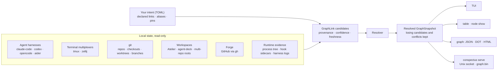

# Conspectus

> *conspectus* (Latin): a comprehensive view; a survey.

Conspectus builds one map of the AI-agent work on your machine. It finds your
agent sessions (Claude Code, Codex, opencode, aider), terminal multiplexer
sessions (tmux, zellij), git repos, checkouts and worktrees, branches,
multi-repo workspaces, forks, and GitHub pull requests. It records every
plausible relationship between them as evidence, then resolves that evidence
into a single provider-neutral graph.

On top of that graph you get a keyboard-driven TUI, scriptable tables, and
JSON, Graphviz, and HTML exports. Conspectus can also take a small set of
explicitly bounded actions: pin a session, launch or attach it in tmux, and
open or close down a worktree.

It is a Rust CLI and library. It is developed on Linux and is pre-release
(`0.1.0`, no tagged release yet); see [Status and limits](#status-and-limits).

```text
updated 0s ago · 10 sessions · 4 mux  ·  ⚠ 4
┌ ▸ sessions · mux ──────────────────────────────────────┐┌   ● session ───────────────────────────────────────────┐
│▼ ▦ showcase-deck  atelier-repo-a…  (agent-deck)  (1)   ││  id            showcase-claude-ambig-a                 │
│    showcase   claude       4m  ◉  Showcase: agent-deck ││  harness       claude-code                             │
│▶ ◆ repo-a         /fixture/atelier-demo/repo-a   (2)   ││  title         ambiguous mux candidate A               │
│▶ ◆ repo-b         /fixture/atelier-demo/repo-b   (1)   ││  cwd           ◇ /fixture/repos/project                │
│▶ ◆ bare-project   /fixture/check…s/bare-project  (1)   ││  status        active · last 4m ago                    │
│▼ ◆ project        /fixture/repos/project         (4)  ⚠││─────────────── 1 validated · 2 other · 2 ⚠  Related ── │
│    showcase   claude       4m  ◯  ambiguous mux candida││  associated with        ◇ /fixture/repos/project       │
│    showcase   claude       4m  ◯  ambiguous mux candida││  ▶ Other  (2 · 2 ⚠)                                    │
│    showcase   claude       4m  ◯  hook-supersession cur││                                                        │
│    showcase   claude       1h  ◯  claude-code in projec││───────────────────────────────────────────── Preview ──│
│▶ Ungrouped                                       (1)   ││loading mux preview…                                    │
│                                                        ││                                                        │
└────────────────────────────────────────────────────────┘└────────────────────────────────────────────────────────┘
[left] group:graph · filter:all · sort:hierarchy · Enter/a attach preferred tmux:ambiguous · Tab inspect candidates
```

<sub>The sessions view rendered from the checked-in showcase fixture
(`tui --snapshot --snapshot-fixture tests/fixtures/showcase.json` in a
`--features snapshot` build).
Sessions are grouped under the workspace and repo they belong to. `◉` means
the session is running in a tmux session you can attach to, and `◯` means it
isn't in one. The selected session sits in a group marked `⚠`: its tmux
attribution is ambiguous, so the right pane lists the competing candidates
under "Other" instead of guessing.</sub>

## Why Conspectus exists

Running several coding agents at once spreads one piece of work across many
tools, and each tool only knows its own part:

- The agent harness knows its transcripts, but not which terminal it runs in.
- tmux knows its panes, but not which agent session a pane is running.
- git knows branches and worktrees, GitHub knows pull requests, and workspace
  tools such as Atelier and [agent-deck](https://github.com/asheshgoplani/agent-deck)
  know their own layouts.
- None of them know how these pieces connect.

The questions you actually ask cut across all of them. *Which agent is in this
tmux session? What branch is it on, and is there a PR yet? Which of the forty
Claude sessions in this repo is the one I compacted yesterday? What is still
running in the worktree I'm about to delete?*

Conspectus answers these questions using state that is already on disk, and
you don't have to change how you launch your agents.

## What makes it different

### 1. A graph, not a session list

Conspectus has ten node kinds: agent session, mux (terminal multiplexer)
session, repo, checkout (a plain clone or a linked worktree), branch,
workspace, fork, forge PR, pin, and runtime process. Twenty-two typed
relation kinds connect them. The graph is sparse by default: an orphan agent
session, a tmux session with no agent, and a branch with a PR but no session
are all valid, not errors. Projections never assume things connect.
([ADR 0001](docs/adr/0001-node-identity-and-stable-ids.md),
[0003](docs/adr/0003-polymorphic-fork-node.md),
[0026](docs/adr/0026-checkout-context-model.md),
[0047](docs/adr/0047-runtime-process-nodes-candidate.md),
[0084](docs/adr/0084-first-class-pin-nodes.md))

### 2. Evidence first, resolution second

Discovery never decides anything. Every plausible relationship becomes a
`GraphLink` candidate that records its provenance (declared, strongly
discovered, discovered, convention, or cached), a confidence level, and how
fresh it is. A resolver then picks the preferred relationship for each slot
and keeps the losing candidates. Ambiguity and conflicts stay visible as data
(the `◐` and `⚠` glyphs, and `conspectus graph --explain` score breakdowns)
instead of being silently collapsed.
([ADR 0002](docs/adr/0002-graphlink-and-typed-relationships.md),
[0006](docs/adr/0006-session-mux-link-candidates.md),
[0041](docs/adr/0041-resolver-stays-in-rust.md),
[0077](docs/adr/0077-resolver-ambiguous-slot-preservation.md))

### 3. Attribution without touching your agents

The hardest link to make is "which agent session is running in which tmux
pane?" Conspectus answers it by layering independent evidence. When
signals disagree, the strongest one wins. This table is simplified;
[mux link resolution](docs/mux-link-resolution.md) has the full rules.

| Rank | Evidence | Where it comes from |
| --- | --- | --- |
| 1 | You declared the link | `.conspectus.toml` or user config |
| 2 | The harness reported its current session, or the pane's process has the session transcript open | Opt-in hook sidecar; `/proc/<pid>/fd` |
| 3 | The harness's own state names the current session | Codex state and log databases (opened read-only); session-file activity |
| 4 | A harness process is running in the pane | Walking the process tree down from the pane's PID |
| 5 | The pane's launch command names a session | The command line (argv) that started the pane |
| 6 | The pane's working directory matches the session's | tmux metadata plus the session transcript |

Stale evidence is demoted by freshness rules. A pane running a single harness
process can claim at most one session. When the evidence still ties,
Conspectus shows the ambiguity rather than guessing.

Conspectus never types into a live agent pane to ask for its session id,
never writes harness-owned state, and never walks your whole home directory.
([ADR 0027](docs/adr/0027-workspace-detection-precedence.md),
[0028](docs/adr/0028-hook-sidecar-mux-attribution.md),
[0046](docs/adr/0046-process-tree-pane-linker.md),
[0048](docs/adr/0048-codex-state-and-log-readers.md))

### 4. Your intent lives in reviewable TOML; everything else is a rebuildable cache

Declared links, session aliases, and pins are small TOML entries in a
`.conspectus.toml` file next to the project. Relationships that don't belong
to any one project go in your user config instead. Both are easy to review
and safe to version-control.

A declared link overrides discovered evidence without erasing it. Caches (the
graph snapshot and the observation sidecars) live under your XDG directories,
never inside a project tree, so deleting them only costs a rebuild.
([ADR 0012](docs/adr/0012-config-file-layout.md),
[0014](docs/adr/0014-declared-link-storage-schema.md),
[0029](docs/adr/0029-session-alias-overlay.md),
[0083](docs/adr/0083-zero-copy-snapshot-format.md))

### 5. Pins: sessions that outlive their processes

Harness session ids change with every `/compact`, `/resume`, and restart, but
the way you think about your work ("the Codex session for the ingest
refactor") doesn't. A **pin** declares that logical session as a harness,
working directory, display name, and tmux session name. It stays on the
dashboard whether or not anything is running.

When a matching tmux session is live, the pin binds to it through the
attribution pipeline above. When the tmux session dies, `Enter` relaunches
it. Conspectus follows the session's compaction and resume chain to the
latest session and resumes that conversation instead of starting a new one.

Conspectus doesn't own your tmux server or impose a window layout. It
records what you intend and reconciles it with what is actually running.
([ADR 0018](docs/adr/0018-intra-harness-session-lineage.md),
[0057](docs/adr/0057-session-pins.md),
[0058](docs/adr/0058-pin-session-continuity.md))

### 6. A bounded mutation envelope

Conspectus is read-only by default. Every write it can make falls into one
of four enumerated categories:

- its own TOML stores;
- rebuildable sidecar files;
- tmux session lifecycle actions (create, rename, attach, tear down) that you
  start yourself;
- subprocesses that Conspectus launches itself.

These prohibitions are absolute:

- no writes to harness-owned state;
- no terminal input into a live agent pane;
- no persisted transcript content;
- no writes to shared or system locations;
- no background mutation;
- no direct git mutation (worktree changes are delegated to
  [worktrunk](https://github.com/max-sixty/worktrunk));
- no skipping hooks or signing: there is no `--no-verify` equivalent, and if
  a hook fails, the write fails.

([ADR 0086](docs/adr/0086-payload-privacy-tenet.md),
[0087](docs/adr/0087-mutation-envelope.md),
[0092](docs/adr/0092-worktree-backend-seam.md),
[0093](docs/adr/0093-operator-initiated-mux-teardown.md))

### 7. The daemon is optional, and JSON is the contract

Every command works on its own by building the graph in-process from scratch.
`conspectus serve` is an optional background daemon that keeps the graph
warm. It refreshes each kind of source on its own schedule and wakes early
when harness state changes on disk. It serves the current graph to clients
over a Unix socket and saves it as a zero-copy [`rkyv`](https://rkyv.org)
archive (`graph.bin`) so that it can restart warm. When the daemon isn't
running, clients fall back to building the graph themselves without any
error.

For other tools, `conspectus graph --format json` is the stable boundary: a
deterministic document of nodes, candidate links, resolved relationships,
and diagnostics.
([ADR 0038](docs/adr/0038-cli-server-transport-wal.md),
[0050](docs/adr/0050-graph-visualization-exports.md),
[0079](docs/adr/0079-server-intervals-dual-role-as-warm-start-ttl.md),
[0082](docs/adr/0082-retire-sqlite-persistence-and-query-surface.md))

## How it works



Each source is read by an adapter registered in a per-family registry:
harness adapters, mux backends, forge adapters, workspace providers, and
worktree backends. Adapters translate provider-specific state into the
neutral model. Everything downstream consumes the same resolved
`GraphSnapshot`, so the TUI, the tables, and the exports can never disagree
about what is linked to what. See the
[provider adapter guide](docs/provider-adapter-guide.md) and the
[north-star design](docs/design.md).

## What it discovers

| Family | Supported today | What Conspectus reads |
| --- | --- | --- |
| Agent harnesses | Claude Code, Codex, opencode, aider | Sessions, titles, last-message previews, and session lineage (compaction, resume, forks). Harness SQLite databases are opened read-only. |
| Terminal multiplexers | tmux; zellij (discovery and attach only) | Sessions, working directories, activity, attached clients, and pane process trees. |
| Version control | git | Repos, checkouts, linked worktrees (including worktrees of bare repos), branches, remotes, and upstreams. |
| Workspaces | Atelier, [agent-deck](https://github.com/asheshgoplani/agent-deck), and generic multi-repo roots | Workspace membership, plus fork provenance from Atelier. |
| Forges | GitHub, via the `gh` CLI | Pull requests, matched to local branches. A GitLab adapter exists only as a stub. |
| Harness hooks (optional) | Claude Code and Codex (`conspectus hook init`), plus an [opencode plugin](plugins/opencode-hook/) | The harness's current session id, which sharpens tmux attribution. |

Discovery starts from the current directory (or the `--scan-root` paths you
pass), plus each harness's home-level state directory. It then checks the
working directory of every session it finds for git context. When a provider
is missing (no tmux server, no `gh`, no harness state), that part of the
graph is simply empty rather than an error.

## Quick start

Conspectus builds from source with stable Rust (2024 edition). From a clone
of this repository:

```sh
cargo install --locked --path .
```

Run it from inside a repo you work in:

```sh
conspectus                                    # open the TUI (same as `conspectus tui`)
conspectus table sessions                     # one row per agent session
conspectus table mux                          # one row per tmux session
conspectus graph --format html > graph.html   # self-contained interactive explorer
```

Two optional extras:

```sh
conspectus hook init claude-code   # let Claude Code report its session id
conspectus serve                   # keep the graph warm in the background
```

## A tour of the surfaces

### Interactive TUI

- **Views.** The Sessions view groups sessions by graph topology by default:
  workspace, then repo, then checkout, with resumed and forked sessions
  nested under their parents. It can also group by workspace, repo,
  checkout, or scan root, or show a flat list. The Mux view shows one row
  per terminal-multiplexer session.
- **Relationship explorer.** The right-hand pane shows a node's own fields,
  its upstream and downstream relationships, how each link was established
  (its provenance), and which candidate the resolver picked. `Enter` drills
  into a neighbor and `Backspace` walks back.
- **Actions.** `Enter` does the obvious thing for the selected row: attach
  to the tmux session, launch the pin, or open the transcript. `v` opens a
  built-in transcript viewer for Claude Code, Codex, and opencode.
- **Menus first, shortcuts second.** `?` lists every key. `f` opens view,
  grouping, filter, and sort controls, and `/` searches. `p`, `m`, and `w`
  open the pin, mux, and worktree menus. Every action can be reached from a
  menu, and the frequent ones also have single-key shortcuts, so you don't
  have to memorize anything to get started.
- **Theming** through `[tui.theme]`
  ([operations guide](docs/operations.md#tuitheme--palette-overrides-adr-0032)).

### Scriptable CLI

```sh
conspectus table {sessions|mux|union|prs|forks} \
    [--columns default,+preview] [--layout card] [--harness codex] [--max-age 7d]
conspectus columns sessions        # list the columns a row type supports
conspectus node show <id>          # one node, its evidence, and diagnostics
conspectus graph --format {json|dot|html} [--explain] [--candidates exclude]
```

Tables adapt to your terminal width, page through `$PAGER`, and respect
`NO_COLOR`. The [graph visualization guide](docs/graph-visualization.md)
covers the DOT and HTML exports.

### Declared links and aliases

```sh
conspectus declared {list|create|remove|confirm|ignore|override} ...
conspectus rename session <id> "ingest refactor"   # alias, plus a matching tmux rename
conspectus rename mux <id> <new-name>
conspectus alias list
```

### Session pins

```sh
conspectus pin create ingest --harness codex --cwd ~/work/ingest
conspectus pin launch ingest          # attach, relaunch, or resume, depending on state
conspectus pin adopt ingest ingest    # turn an already-running tmux session into a pin
conspectus pin {list|show|attach|rename|rm|bind|rebind} ...
```

A pin is in one of four states: `bound` (live and attributed), `unbound`
(no tmux session yet, or it died), stale (the tmux session is alive but the
agent has exited), or ambiguous (several sessions claim it). Each state has
a matching recovery action. The
[pins walkthrough](docs/pins-walkthrough.md) teaches the lifecycle, and
[operations](docs/operations.md#session-pins) is the reference.

### Launching tmux sessions

```sh
conspectus mux new scratch --cwd ~/work/ingest               # bare shell, nothing persisted
conspectus mux launch codex --name spike --cwd ~/work/ingest  # agent in a new tmux session, no pin
```

### Worktree streams

```sh
conspectus worktree list                                     # read-only; always available
conspectus pin create feat-x --harness claude-code \
    --cwd ~/work/repo --worktree feat-x                      # worktree created when the pin launches
conspectus worktree close feat-x --merge                     # stop sessions, merge, remove worktree, drop pins
conspectus worktree {new|rm|merge|prune} ...
```

Listing worktrees is built in. Creating, removing, merging, and pruning them
is delegated to [worktrunk](https://github.com/max-sixty/worktrunk)
(`wt`), which must be on your `PATH`. Conspectus itself never runs
`git worktree add` or `remove`. See the [worktrees guide](docs/worktrees.md).

### Continuous mode

```sh
conspectus serve                        # default refresh: harness 5s, mux 5s, git 30s, forge 5m
conspectus status                       # when each kind of source last refreshed, and any errors
conspectus refresh [--class git|mux|harness|forge]
```

## How Conspectus is built

Conspectus is written by one developer working with AI coding agents. The
repository is set up so that agents can do most of the implementation
without drifting from the design. The project's memory lives in three files
checked into the repo, not in chat history.

### `docs/design.md`: the north star

The [design document](docs/design.md) is written data-model-first. It covers
the product goal, the entity model, and the discovery, persistence, and
mutation rules. Every feature is checked against the graph model before it is
built, which is why provider specifics (tmux, GitHub, each harness) live in
adapters and metadata rather than in the shape of the graph. The design
document stays short enough to plan from, and the detailed reasoning lives in
ADRs.

### `docs/adr/`: 97 architecture decision records

Every significant decision gets an ADR, whether it's a model change, a new
dependency, a new write path, a workflow tool, or a UI convention. Each ADR
follows the same template: Status, Context, Decision, Consequences,
Alternatives Considered, and, where it applies, Open Questions Answered. A few
habits have grown out of that discipline:

- **Few dependencies.** Adding a crate requires an ADR that compares the
  alternatives, and many of those ADRs conclude "keep it in-tree": no rules
  engine ([0059](docs/adr/0059-resolver-rules-engine-evaluation.md)), no
  `sysinfo` ([0046](docs/adr/0046-process-tree-pane-linker.md)), no
  scrollbar crate ([0076](docs/adr/0076-scrollbar-widget-choice.md)), and
  OSC 52 escape codes instead of a clipboard crate
  ([0056](docs/adr/0056-tui-clipboard-backend-osc52.md)).
- **Named revisit triggers.** Many decisions name the condition that should
  reopen them, so revisiting a decision is planned rather than ad hoc.
- **Superseded, never deleted.** Retired decisions stay in place, with a link
  forward to whatever replaced them.
- **Cheap reversals.** Over about four weeks the project built an embedded
  SQL persistence, query, and vector-search layer
  ([0036](docs/adr/0036-embedded-query-engine-selection.md)–[0044](docs/adr/0044-nodeid-foreign-references-as-json.md)).
  It then recognized that the design had made storage the thing views read
  from, and replaced the layer with a zero-copy snapshot
  ([0082](docs/adr/0082-retire-sqlite-persistence-and-query-surface.md),
  [0083](docs/adr/0083-zero-copy-snapshot-format.md)). Because an earlier
  ADR had kept the resolver in Rust
  ([0041](docs/adr/0041-resolver-stays-in-rust.md)), undoing it meant
  swapping out the storage, not rewriting the application. ADR 0082 records
  two lessons: consumers read the typed model, and no capability lands
  before something needs it.

### Backlog.md: the work tracker

Work is tracked as [Backlog.md](https://backlog.md) task files under
[`backlog/`](backlog/): one Markdown file per story, plus a milestone for
each phase or workstream. The backlog began as a single file,
`docs/backlog.md`, which [ADR 0009](docs/adr/0009-lightweight-backlog-tracking.md)
chose over Beads, Backlog.md, and GitHub Issues while the project was young.
At 622 stories and over 15,000 lines it moved to Backlog.md
([ADR 0109](docs/adr/0109-backlog-md-work-tracking.md)), with every story
converted and renumbered in the order it was filed.

Every story has a stable ID (`CSP-175`), a scope, the tests it needs, its
blockers, and a final summary once it lands. The IDs appear in commit
subjects, so `git log --grep` connects a decision, the work it caused, and
the code it produced, and `backlog task list --ready` shows what can start
now. Commits from before the migration cite the old per-workstream IDs
(`P8-014`, `H-PIN-TUI-011`); [a map](docs/backlog-legacy-ids.md) translates
them.

Numbered phases (P0 through P11) cover the planned arc. Hardening workstreams
(labeled `h-*`) and dated batches of operator requests cover what came up in
daily use.

### Making the loop work with agents

- **Guardrails in the repo.** [`AGENTS.md`](AGENTS.md) (also available as
  `CLAUDE.md`) spells out the rules: design data-model-first, keep the core
  provider-neutral, treat the graph as sparse, stay inside the mutation
  envelope, record decisions as ADRs, use Conventional Commits, and pass the
  checks before merging to main.
- **A UI agents can see.** `conspectus tui --snapshot` renders a single frame
  to stdout, with ANSI colors preserved, after replaying a scripted key
  sequence. It can render the live world or a checked-in fixture, so an
  agent can iterate on the interface without asking a human for screenshots
  ([ADRs 0067–0070](docs/adr/0067-tui-snapshot-mode-for-agent-iteration.md)).
- **Offline, deterministic tests.** Fake tmux, `gh`, and git runners;
  programmatic replay worlds; sanitized captures of real provider data; named
  developer scenarios; and `insta` snapshot tests. The whole suite runs in a
  few seconds.
- **Periodic audits.** An [ADR corpus audit](docs/adr-audit.md), a
  [code-hygiene audit](docs/code-hygiene-audit.md), and an
  [extensibility assessment](docs/extensibility-assessment.md) each turned
  accumulated drift into backlog items.

### By the numbers (as of 2026-09-30)

| Measure | Value |
| --- | --- |
| Development window | 2026-05-12 to 2026-09-30 |
| Commits | 850, of which 650 (76%) have an AI co-author trailer |
| Architecture decision records | 97, of which 10 are superseded or partially superseded |
| Backlog items | about 590, of which nearly 80% are checked off |
| Commits that touch `docs/backlog.md` | 413 (49%) |
| Rust | about 130k lines, over 40% of it tests |
| Tests | 2,081, all passing, in about 5 seconds with `cargo nextest` |

## Status and limits

- **Pre-release.** The version is `0.1.0`. There is no tagged release and no
  crates.io package, so install from source.
- **Linux first.** Process-tree attribution reads `/proc`. On platforms
  without it, attribution falls back to the remaining evidence. macOS is
  untested.
- **tmux is the primary mux backend.** zellij supports discovery and attach
  only. Pins on a non-default tmux socket (`tmux -L`) launch and attach
  correctly, but discovery doesn't list those sockets yet.
- **GitHub only.** Forge discovery goes through an authenticated `gh` CLI.
  GitLab is a stub.
- **Worktree mutation needs worktrunk.** Without `wt` on your `PATH`,
  worktree support is read-only.
- **The library API isn't stable yet.** `conspectus::api` exists
  ([library API](docs/library-api.md)), but no external consumer relies on
  it, so treat it as unstable.
- **Atelier support targets an unreleased companion tool.** Atelier is the
  workspace and fork tool Conspectus grew out of, and it isn't public yet.

## Documentation

| If you want to… | Read |
| --- | --- |
| Configure and run it: environment variables, config files, the CLI reference, caches, TUI state | [docs/operations.md](docs/operations.md) |
| Learn pins hands-on | [docs/pins-walkthrough.md](docs/pins-walkthrough.md) |
| Manage worktrees and streams of work | [docs/worktrees.md](docs/worktrees.md) |
| Export and explore the graph visually | [docs/graph-visualization.md](docs/graph-visualization.md) |
| Understand the model and intent | [docs/design.md](docs/design.md) |
| See why things are the way they are | [docs/adr/](docs/adr/README.md) |
| Understand how sessions get attributed to tmux panes | [docs/mux-link-resolution.md](docs/mux-link-resolution.md) |
| Add a harness, mux, forge, or orchestrator adapter | [docs/provider-adapter-guide.md](docs/provider-adapter-guide.md) |
| Use Conspectus as a library | [docs/library-api.md](docs/library-api.md) |
| See what's being worked on | [backlog/](backlog/) (`backlog board`) |
| Find every document | [docs/index.md](docs/index.md) |

## Development

```sh
nix develop    # Rust toolchain, cargo-nextest, just, tmux, gh
just check     # fmt, clippy -D warnings, test, nextest, git diff --check
```

To iterate on the TUI, use snapshot mode instead of screenshots. It lives
behind the developer-only `snapshot` cargo feature, which `just check` and CI
enable through `--all-features`:

```sh
cargo run --features snapshot -- tui --snapshot --snapshot-pane left --snapshot-keys 'jj<Enter>'
cargo run --features snapshot -- tui --snapshot --snapshot-pane right --snapshot-keys 'j<Tab>jjjjj'
cargo run --features snapshot -- tui --snapshot --snapshot-fixture tests/fixtures/showcase.json
cargo run --features snapshot -- tui --fixture tests/fixtures/showcase.json   # interactive; `r` reloads
```

`just demo` runs that last command, which is the easiest way to show the TUI
without exposing your own sessions.

[docs/dev-scenarios.md](docs/dev-scenarios.md) covers the fixture workflow,
the three test-world surfaces (`ReplayWorld`, the captured-fixture corpus,
and named `dev_scenarios`), and the `showcase` scenario that exercises most
features at once. Commit, review, and pre-merge conventions are in
[`AGENTS.md`](AGENTS.md).

## License

MIT; see [`LICENSE`](LICENSE). The vendored JavaScript behind the HTML
graph explorer carries its own MIT notices in
[`src/output/html/assets/NOTICE`](src/output/html/assets/NOTICE).
