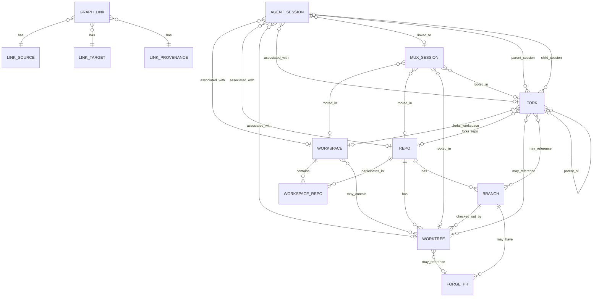

# Conspectus Design

Extract session discovery, mux status, fork/session attribution, and forge
association into a separate binary that complements atelier. The goal is to
reduce atelier's CLI surface area while preserving enough shared code to avoid
duplicating brittle harness and workspace discovery logic.

This document is the north star for breaking Conspectus work into phases,
stories, and implementation tasks. Accepted Architecture Decision Records in
`docs/adr/` provide the detailed rationale behind major data-model decisions;
this design document should stay aligned with those decisions and summarize the
current intended shape.

## Product Goal

Build an opinionated read-only-first status tool for the user's AI work graph.
It should show, in one integrated view:

- agent sessions across all supported AI CLI tools
- associated repos, worktrees, branches, and workspaces
- mux sessions linked to workspaces, worktrees, or agent sessions
- forge PRs linked to branches/worktrees
- fork provenance across context, branch, worktree, and session effects
- basic activity/status signals where each source can provide them

Unlike `atelier status`, this tool should discover sparse records. A row with
only an agent session is valid; so is a row with only a tmux session rooted in a
repo, or a worktree branch with an open PR and no known agent session.

## Design Requirements

- Conspectus is focused on capturing links among ephemeral entities such as
  agent sessions and forks, lifecycled entities such as PRs, and long-lived
  entities such as repositories. It builds those links into a graph that helps
  users navigate the explicit and implicit project structure that emerges from
  using one or more agent harnesses.
- Design data-model-first. The core graph should be stable enough to serve as
  the foundation for the project as it matures. New features and behavioral
  changes should be assessed against the data model first, with implementation
  flowing outward from there.
- Provider-specific reality is allowed at the edges, but the graph shape stays
  provider-neutral. V1 can know about concrete providers such as Atelier, tmux,
  GitHub, and specific agent harnesses without making their private schemas the
  public graph model.
- Conspectus was seeded from the atelier repository, but it is not beholden to
  Atelier's data model. Atelier metadata is an important input source, not the
  shape the Conspectus graph must copy.
- Consumers of the Conspectus graph, including Conspectus's own tabular views,
  must assume the graph is inherently sparse. Many projects will form separate
  cliques, and many useful links will be missing because they cannot be
  auto-discovered.
- Derive as many links as possible from on-disk state and common workflow
  conventions. Conspectus should recognize common workflows without requiring
  users to scatter override files across every repo and workspace.
- Allow global and local overrides to establish, confirm, ignore, or replace
  links, but make overrides rare by improving discovery and convention support.
  User-authored link state should be federated near the repo or workspace when
  the relationship is project-rooted.
- Keep performance caches and other rebuildable indexes outside any given repo
  or workspace. Caches may accelerate discovery, but they must not become the
  only durable representation of user intent.
- Use a loose definition of `Workspace`: a folder where one or more git repos,
  symlinks to repos, or worktrees from repos are present together with the
  intent to make coordinated changes among them. Conspectus may assume
  conventions such as matching branch names when those conventions produce sane
  defaults for workspace-oriented views.
- Conspectus does not own workspace contents beyond the links it tracks. It can
  read workspace metadata, derive relationships from layout, and write explicit
  Conspectus link state on demand, but it should not become a workspace
  materializer.
- Use a loose definition of `Fork`, or multiple fork terms if needed, centered
  on tracking provenance of agent sessions, git branches, worktrees, and related
  state. The model should support context lineage and session lineage without
  assuming every provider implements both in the same way.
- The initial interface is a CLI with two primary purposes: present tabular
  views of the graph built from derived or specified links, and provide commands
  for users to create, read, update, and delete those links.
- Conspectus should expose a machine-readable graph for other tools to consume.
  Future consumers may include interactive TUIs that manage agent sessions,
  connect to mux sessions, or provide workflows similar to agent-deck.
- Support both one-shot CLI invocations and a long-running continuous mode
  that maintains a live graph in the background. The continuous mode is
  optional; the one-shot CLI must remain useful without a server running.
  Graph generation cost must not require the one-shot path to rebuild every
  link from scratch on each invocation.

## Relationship To Atelier

Atelier remains a workspace materializer and policy launcher:

- creates and manages one flavor of multi-repo workspace
- creates worktrees and fork metadata that conspectus can ingest
- owns `atelier.toml` and `.atelier/forks/index.toml`
- generates harness config and wrapper scripts
- launches harnesses through workspace policy

The new binary owns cross-workspace observability:

- global and workspace-local session discovery
- mux session discovery
- forge correlation
- sparse status tables and JSON output
- optional user-defined links between discovered entities

Code sharing should be formal but minimal. Prefer a shared internal library or
small common crates for pure discovery/parsing types. Avoid making the new tool
depend on atelier command modules directly. Leave room to extract the new tool
into a separate repository later.

Likely atelier features to move or delegate over time:

- `atelier session list`
- `atelier mux status`
- forge/PR status integration
- portions of `atelier status` that are really graph observability rather than
  workspace materialization health

## Initial Scope

Start read-only, but design the data model and storage layout for quick follow-up
commands that let users add or remove links manually.

Concrete v1 sources:

- harnesses: same support set as atelier for now (`claude-code`, `opencode`,
  `codex`, `aider`)
- mux: tmux as the first implementation
- forge: GitHub as the first implementation
- workspaces: loose workspace groupings and individual git repos/worktrees

Design abstractions for additional harnesses, mux backends, and forge providers,
but do not implement them until needed.

## Core Model

Represent the world as nodes and links.

Nodes:

- `AgentSession`
- `MuxSession`
- `Repo`
- `Worktree`
- `Branch`
- `Workspace`
- `Fork`
- `ForgePr`

Links:

- agent session launched from cwd/worktree
- agent session belongs to workspace or fork provenance
- mux session rooted at path
- mux session linked to agent session
- worktree belongs to repo and branch
- branch has forge PR
- forks record parent/child lineage and link to affected repos, worktrees,
  branches, paths, and agent sessions
- user-declared override or confirmation

Links should carry provenance:

- `discovered`: inferred from a path, transcript, branch, forge query, or mux
  metadata
- `convention`: inferred from naming/path conventions such as fork roots or
  workspace layout
- `declared`: explicitly configured by the user
- `cached`: remembered for performance and invalidated by freshness rules

Graph collection produces candidate `GraphLink` records first. A resolver turns
candidate links into typed relationships for table projections and higher-level
graph views. Manual `declared` links should win over discovered links when they
conflict, but they should not delete the original evidence.

## Entity Relationship Draft

This ERD is a pressure-test target, not final schema. It separates first-class
things the user reasons about from relationship records that carry provenance.



Entity notes:

- `Repo` is the durable git repository identity. A single repo can stand alone
  or participate in one or more workspaces over time.
- `Workspace` is a folder-level working context where one or more git repos,
  symlinks to repos, or worktrees from repos are present together with the
  intent to make coordinated changes among them. A workspace may be inferred
  from layout/convention, ephemeral with no versioned metadata, or persistent
  with metadata describing its intended shape.
- `Workspace` contains repo memberships through `WorkspaceRepo`, not by owning
  repos outright.
- `WorkspaceRepo` is a membership edge because workspace membership may carry
  workspace-local identity, path, role, checkout policy, or whether the member
  is a concrete checkout, symlink, or convention-derived participant.
- `Worktree` is a concrete checkout path for a repo. It normally has exactly
  one current branch, but the branch can change as the checkout changes.
- `Branch` belongs to a repo and may have zero or more forge PRs. Multiple PRs
  are possible across forges, remotes, closed historical PRs, or ambiguous
  branch reuse.
- `Fork` is a polymorphic provider-neutral node for fork-like provenance. It can
  represent context effects, session effects, both, or metadata-only provenance.
  Its meaning is expressed through attributes, provider/source metadata, and
  links to affected workspaces, repos, worktrees, branches, paths, sessions, and
  parent/child forks.
- `AgentSession` is a harness-native session record. It may be global, orphaned,
  repo-rooted, worktree-rooted, workspace-rooted, or fork-associated.
- `MuxSession` is a terminal multiplexer session. It can be linked to an agent
  session and/or rooted in a workspace, repo, worktree, or fork path.
- `ForgePr` is a forge pull request record. GitHub is the only v1 provider, but
  the entity should not encode GitHub-specific assumptions into the graph shape.
- `GraphLink` is the canonical candidate/evidence edge record used for
  discovery, conventions, caches, declared state, diagnostics, and
  machine-readable graph output. It captures source, target or unresolved
  endpoint evidence, relation kind, provenance, confidence, freshness, and
  whether it is ignored or overridden.

Expected cardinality and sparsity:

- A repo can exist with no workspace; a workspace can contain many repos.
- A repo can have many worktrees; a worktree is for one repo.
- A workspace can contain many repo participants, including worktrees, ordinary
  repos, symlinks, or convention-derived members. A worktree may be outside any
  workspace.
- A fork can affect a repo, a workspace, sessions, branches, worktrees, paths,
  or any combination of those. It may create concrete worktrees, reference
  existing worktrees, create or associate branches, represent session lineage,
  or be represented only by provider metadata.
- A fork can have zero or one parent fork and many child forks.
- Session-lineage endpoints may be unresolved. Parent or child session evidence
  can exist before the corresponding `AgentSession` node has been discovered.
- Session lineage edges may be either fork-anchored (sourced at a `Fork` node,
  as in ADR 0005) or directly between two `AgentSession` nodes for
  intra-harness compaction/resume (ADR 0018).
- An agent session can exist without any known repo, worktree, workspace, mux
  session, or PR.
- A mux session can exist without any known agent session.
- An agent session can have many candidate mux links. A resolver may choose one
  preferred mux for a projection, but the graph should preserve all candidates
  for diagnostics and picker-style UIs.
- A mux session may contain multiple agent sessions in practice. The `agent`
  projection renders one row per agent session; the `mux` projection can render
  zero, one, or many linked agent sessions per mux.
- A branch can have zero, one, or many PR records. The table view should prefer
  open PRs and report ambiguity rather than collapsing it silently.

Fork effect matrix:

| Context Effects | Session Effects | Meaning |
| --- | --- | --- |
| yes | yes | Heavyweight fork-like workflow. A single `Fork` records both context provenance and session lineage evidence. |
| yes | no | Context-only fork-like workflow for pure git, branch/worktree experiments, or pre-staging later agent work. |
| no | yes | Session-only fork-like workflow for parallel non-colliding work, read-only agents, or multiple agents sharing one context. |
| metadata only | optional | Provider records a fork root or operation but no concrete context or session endpoints have been discovered yet. |
| no | no | Noop. Do not support or persist this as a fork node unless provider metadata supplies meaningful provenance. |

Lifecycle transitions:

- Single repo to workspace: grouping one or more repos, symlinks, or worktrees
  under a common folder creates a `Workspace` plus `WorkspaceRepo` membership.
  Existing repo-local links remain valid and can be shadowed by workspace-local
  links when more specific.
- Workspace to standalone repo: removing or ignoring a workspace should not
  delete repo, worktree, branch, agent session, mux session, or PR nodes. The
  graph should degrade to repo/worktree associations.
- Context-like fork: forking a repo or workspace creates a `Fork` node and may
  create worktrees, reference existing worktrees, create or associate branches,
  record a fork root, or record only provider metadata. Existing sessions rooted
  in those paths may gain fork associations on the next discovery pass.
- Session-like fork: forking an agent session creates `parent_session` and/or
  `child_session` link candidates from the `Fork`. It may reuse the same
  worktree when no context effect was requested. Missing endpoints remain
  unresolved evidence until a concrete `AgentSession` is discovered or declared.
- Combined fork: a heavyweight fork-like workflow creates one `Fork` node with
  both context-effect links and session-lineage links.
- Context effects without session effects are supported for pure git workflows.
- Session effects without context effects are supported for parallel work that
  will not collide, read-only agents, or multi-agent setups where separate
  session state is useful without a new checkout.
- Fork with no context effect, no session effect, and no meaningful provider
  provenance is a noop; do not create a graph node.
- Fork back to ordinary worktree: if fork metadata disappears but the worktree
  remains, sessions should keep their worktree/repo links and lose only the
  fork lineage unless a declared link preserves it.
- Orphan session to rooted session: when a later discovery pass finds cwd,
  transcript, mux, or declared metadata, the same `AgentSession` can gain links
  to repo/worktree/workspace/fork nodes without changing session identity.
- Discovered link to declared link: user confirmation or override should create
  a durable `GraphLink` with `declared` provenance, leaving the discovered link
  visible in detailed diagnostics.

## Discovery Strategy

Default discovery should be useful without scanning the user's entire home tree.
The sane default is:

- read home-global agent-specific state/config directories for supported
  harnesses
- read mux sessions from the configured mux backend
- inspect cwd and explicitly configured scan roots
- read known workspace metadata from supported providers when a workspace is
  discovered
- inspect git metadata for discovered repos/worktrees
- query GitHub for PRs associated with discovered repo/branch pairs

Discovery should prefer direct on-disk evidence first, then provider metadata,
then common conventions, then user-declared overrides. Conventions such as
matching branch names or known fork roots should create useful candidate links,
but they should carry provenance and confidence rather than silently becoming
facts.

Additive discovery:

- allow users to opt in workspace/repo roots manually
- support autodiscovery from known workspace locations or config files
- support a future "bootstrap" mode that recursively scans selected roots,
  including `$HOME` only when explicitly requested

Avoid default behavior that recursively walks all of `$HOME`.

In continuous operation mode (see below), each discovery source runs on
its own refresh cadence rather than as a single end-to-end scan. Provider
abstractions stay identical to the one-shot path; the difference is in
how often each provider is invoked and how its output is merged into the
existing graph.

## State And Persistence

Track the minimum necessary state to tie entities together. Persist user intent;
derive everything else from on-disk state, provider metadata, conventions, or
rebuildable caches whenever possible.

Project/workspace-local state is preferred for durable relationships:

- user-declared links for sessions rooted in a workspace should live as close to
  that workspace/project as possible
- mappings should be suitable for version control when the workspace state is
  versioned
- this preserves the future path toward portable, version-controlled agent
  sessions and persistent cross-machine session IDs

Global state is acceptable for:

- global/orphan sessions that do not belong to a workspace
- user-wide scan roots and ignore rules
- performance caches
- cached forge metadata
- last-seen indexes

Hybrid rule of thumb:

- if an entity is rooted under a workspace or a git repo with a local
  metadata area, store durable declared links locally
- if an entity is home-global or cannot be tied to a project, store declared
  links globally
- caches and rebuildable indexes should be global even when durable
  declarations are local, so cache rebuilds do not dirty project trees or lose
  user intent

Local and global state locations:

- persistent workspace: `.conspectus.toml`
- standalone repo: `.conspectus.toml`
- provider-specific workspace metadata may point at an alternate local state
  file when that provider owns a private metadata directory
- global config: `$XDG_CONFIG_HOME/conspectus/config.toml`
- global cache/index: `$XDG_DATA_HOME/conspectus/`

Local declared-link files should be created only on demand, when the first
manual link/ignore/override command needs to persist user intent. Read-only
discovery should not dirty a repo or workspace.

Durable declared state should use TOML for the first implementation. The files
need to be reviewable, hand-editable, and reasonable to version-control. A
future SQLite or line-oriented store is acceptable for caches and indexes, but
should not become the only representation of user-authored relationships unless
there is a clear migration story back to portable project-local state.

Do not make session portability part of this refactor, but avoid storage choices
that would make portable session IDs or version-controlled session state harder.

## Manual Link Commands

Post-v1 commands should let users create, read, update, and delete
relationships that discovery cannot infer:

- link/unlink mux session to agent session
- link/unlink GitHub PR to worktree or branch
- link/unlink agent session to workspace, repo, worktree, or fork
- mark session/repo/mux rows ignored
- confirm or override a discovered relationship

These commands should write declared links to the nearest appropriate local or
global store according to the persistence rules above.

## Status Views

The default `conspectus session` table should be AgentSession-oriented: one row
per discovered agent session, with mux information shown as a sparse joined
column when a mux session can be linked. This avoids pretending agent sessions
and mux sessions are the same kind of thing.

The session view should support configurable projections:

- `agent`: default; one row per agent session, with linked mux data in sparse
  columns
- `mux`: one row per mux session, with linked agent data in sparse columns
- `union`: rows for both node types, with a `tool` / `kind` column

Use `session.projection` as the configuration key in TOML:

```toml
[session]
projection = "agent" # "agent", "mux", or "union"
```

Future TODO: if no agent sessions are auto-discovered but mux sessions are
available, consider falling back to the MuxSession-oriented view for that run,
with an explicit note.

Candidate columns for the default AgentSession-oriented table:

- agent/tool
- session id
- activity/status
- mux session
- repo/worktree
- branch
- workspace
- fork
- lineage
- PR
- last activity
- provenance/confidence

Machine-readable output should preserve the graph shape directly: nodes, links,
provenance, and source metadata. The table can be a projection over that graph.
The first implementation can expose this as JSON, but the interface should be
treated as a graph API for future tools rather than a table serialization.

Machine-readable output should distinguish raw candidate links from resolved
relationships. Candidate links preserve discovery evidence, provenance,
confidence, freshness, ignored/overridden state, and unresolved endpoint
metadata. Resolved relationships are the projection chosen by the resolver for a
given graph snapshot.

Declared relationships should be authoritative but not destructive:

- local declared links win over global declared links
- declared links win over discovered links
- fresh discovered links win over cached links
- conflicts are displayed as status, not treated as fatal errors
- detailed output should show all candidate links and their provenance

Fork-aware views should:

- read fork metadata from supported providers when available
- show context-effect lineage and session-lineage evidence separately when a
  single `Fork` has both kinds of links
- show one provider-visible `Fork` when a single user action affected both
  context and session state
- associate sessions rooted in fork paths or fork-associated session state
- associate mux sessions rooted under fork paths
- fall back to path/branch/session conventions when provider metadata is
  unavailable

Mux-aware views should:

- preserve all candidate agent-session-to-mux links
- select one preferred mux link per agent-session row when evidence supports it
- show ambiguity when multiple non-ignored candidates remain
- allow mux-oriented views to show zero, one, or many linked agent sessions

## Continuous Operation Mode

Conspectus supports two operation modes:

- **One-shot CLI**: each invocation performs a fresh (or warm-started)
  discovery pass, renders output, and exits. This is the default.
- **Continuous server**: a long-running process maintains the graph in
  memory and schedules per-provider refreshes on configurable intervals.
  CLI invocations talk to the server when one is running and fall back
  to one-shot discovery otherwise.

The server avoids fully evented design as a starting point. Interval-based
polling per discovery source is sufficient for the v1 of this mode.
Filesystem watchers (inotify, fsevents) are a future optimization for
cheap signals (harness state directories, git refs), not a prerequisite.

Defaults skew toward "responsive but quiet": short intervals for cheap
local sources, longer intervals for expensive ones. Concrete starting
points (configurable per provider class):

- harness state directories: a few seconds
- mux backends: a few seconds
- git repo/worktree probes: tens of seconds
- forge metadata (e.g. `gh pr list`): minutes

Provider failures are isolated. A broken `gh` binary, unreachable mux
backend, or unreadable harness state directory must not halt unrelated
providers. Each provider carries its own success/failure status,
last-refresh timestamp, and back-off, all surfaced to the resolver and
status views.

The server lifecycle is user-managed (systemd user unit, launchd agent,
or a manual `conspectus serve &`). The CLI must not auto-spawn a daemon
on regular invocations; absence of a server is not an error.

Transport between the CLI and the server is an open question (Unix
domain socket, file-based snapshot polling, or both); the immediate
constraint is that it work for a single user on a single machine.

Configuration extends the existing TOML config with a `[server]` table
plus per-provider interval keys; specific keys and defaults belong in
the corresponding ADR.

## Graph Snapshot Persistence

Graph generation is cheap for small graphs but already perceptibly slow
when discovery touches many harness state directories, many repos, or
expensive forge calls. Both the continuous server and the one-shot CLI
benefit from persisting the resolved graph between runs.

- Snapshots live under `$XDG_DATA_HOME/conspectus/snapshots/`. They are
  never written inside project trees.
- Format is a versioned JSON document: the resolved `GraphSnapshot`
  shape extended with a schema version and a per-provider freshness
  map. JSON keeps snapshots hand-inspectable; a binary format may be
  reconsidered later if size or load latency become real concerns.
- Writes are atomic: write to a temp file in the same directory, then
  rename. A crash mid-save must not corrupt the snapshot.
- A small number of rotated snapshots are retained for debugging;
  older snapshots are pruned on each save.

Each node and candidate link in the persisted graph carries the
provider that produced it and a freshness timestamp. This provenance
is what makes partial eviction possible:

- The unit of refresh is a single provider's slice of the graph.
- Re-running a provider discards that provider's prior nodes and
  candidate links and merges its new output back in; declared links,
  other providers' slices, and the resolver's prior output remain.
- The resolver re-runs against the merged candidate-link set whenever
  any provider slice changes. Re-run cadence (eager, batched, or lazy)
  is left to the implementing ADR.

The one-shot CLI's warm-start path:

1. Load the most recent snapshot if its schema version matches.
2. For each provider, compare its freshness timestamp against its
   configured TTL.
3. Re-run only providers whose TTL has expired; reuse the rest.
4. Re-resolve and render.

If no snapshot exists, the schema version differs, or `--no-cache` /
`--refresh` is requested, fall back to a cold rebuild.

Snapshot persistence is independent of the server. Both modes share
the same on-disk format. The server is the only writer when it is
running; the one-shot CLI is the writer otherwise.

## Migration Plan

1. Complete: identify and isolate pure discovery/parsing code in Conspectus:
   - harness session discovery
   - mux session discovery
   - workspace/fork metadata readers
   - git repo/worktree/branch probes
   - GitHub PR association
2. Complete: expose reusable pieces through Conspectus library interfaces that
   do not depend on Atelier command modules. ADR 0015 defines the stable library
   surface and `docs/library-api.md` inventories pure and impure boundaries.
3. Complete: add the standalone binary with read-only graph collection and JSON
   output.
4. Complete: add table rendering for sparse rows, mux projections, forge PR
   context, and fork lineage.
5. Complete: add local/global declared-link stores plus manual relationship
   commands.
6. In progress: have Atelier delegate or deprecate overlapping commands:
   - `atelier session list`
   - `atelier mux status`
   - forge-related status surfaces
   - graph-heavy parts of `atelier status`
   The Conspectus side is tracked by the Phase 6 backlog and
   `docs/atelier-migration.md`; the Atelier side is tracked in Atelier commit
   `b765c16`.
7. Pending Phase 6 decision: reassess whether the standalone binary should stay
   in this repository or be extracted once the shared library boundary
   stabilizes. ADR 0015 defines the current API contract and ADR 0016 defines
   the distribution policy that any extraction must preserve.

## Decisions

- Name: `conspectus`.
- Accepted ADRs:
  - ADR 0001: use structured provider-aware local node identities.
  - ADR 0002: collect all relationship evidence as `GraphLink` candidates and
    derive typed resolved relationships from them.
  - ADR 0003: use one polymorphic `Fork` node instead of multiple fork node
    classes.
  - ADR 0004: represent fork context effects with provider-neutral relation
    kinds such as `created_worktree`, `referenced_worktree`, `created_branch`,
    `associated_branch`, `rooted_at_path`, and `parent_fork`.
  - ADR 0005: preserve unresolved session-lineage endpoint evidence without
    creating placeholder `AgentSession` nodes.
  - ADR 0018: allow intra-harness `parent_session` / `child_session` links to
    attach directly between two `AgentSession` nodes, and standardize a
    `lineage_kind` operation vocabulary separate from `lineage_fidelity`.
  - ADR 0006: preserve many mux/session link candidates and let projections
    choose preferred links while exposing ambiguity.
  - ADR 0015: stabilize the Conspectus library API surface and add a curated
    facade for consumers.
  - ADR 0016: prefer crates.io releases for steady-state distribution, allow
    pinned git revisions for Atelier migration, and keep path dependencies
    local-development only.
- Node identity:
  - repos use canonical git common dir for local discovery
  - worktrees use repo identity plus canonical worktree root
  - workspaces use provider plus canonical root, or canonical root for generic
    inferred workspaces
  - agent sessions use harness key, state root or scope, and native session id
    or source-path fallback
  - branches use repo identity plus refname
  - forge PRs use provider, host, owner, repo, and PR number
- Local state files:
  - persistent workspace: `.conspectus.toml`
  - standalone repo: `.conspectus.toml`
  - provider-specific workspace metadata may redirect to a provider-owned local
    state path
- Global paths:
  - config: `$XDG_CONFIG_HOME/conspectus/config.toml`
  - cache/index: `$XDG_DATA_HOME/conspectus/`
- Local declared-link files are write-on-demand only.
- Declared links win over discovered links; conflicts are displayed, not fatal.
- Durable declared state should be TOML; cache/index internals may use another
  storage format later.
- Default `conspectus session` view is AgentSession-oriented with MuxSession as
  a sparse joined column.
- Alternate session projections should be configurable as `agent`, `mux`, and
  `union`.
- The config key for selecting a session projection is `session.projection`.
- Bootstrap scans should print suggested roots and links by default. Persisting
  them to global config should require an explicit write flag.
- Conspectus supports an opt-in continuous server mode that maintains a live
  graph via per-provider interval-based refreshes. The one-shot CLI remains
  the default and works without a server.
- Graph snapshots persist as versioned JSON under
  `$XDG_DATA_HOME/conspectus/snapshots/`. Partial eviction operates at
  provider granularity using node/link provenance and per-provider freshness
  timestamps; both the server and the one-shot CLI use the same format.

## Remaining Design Questions

The remaining open questions should be settled before or during phase planning
only when the answer materially changes implementation scope.

### Workspace Detection And Identity

- What concrete evidence threshold should make Conspectus infer a `Workspace`
  instead of merely a repo parent directory or scan root?
- How should nested workspaces, nested git repos, and workspaces containing
  symlinked repos be handled?
- How should generic workspace discovery interact with provider-specific
  metadata such as `atelier.toml` and `.atelier/forks/index.toml`?
- If multiple workspace providers claim the same path, which provider supplies
  identity, membership, and local state location?

### Forge PR Identity And Branch Association

- What provider-neutral fields define `ForgePr` identity while still preserving
  GitHub-specific data such as owner, repo, number, head repo, head branch, base
  repo, and state?
- Is a branch-to-PR association keyed by branch name, local branch plus remote,
  upstream tracking branch, forge head ref, or a combination?
- How should the graph represent multiple PRs for one branch across remotes,
  closed historical PRs, branch reuse, and forked head repositories?

### Declared-Link Conflict Semantics

- What exactly does an override suppress: a single candidate link, all links of
  a relation kind for a source node, or all discovered links between two nodes?
- Is "ignored" a node-level flag, a link-level flag, or both?
- How are local declared links, global declared links, discovered links, and
  cached links merged when they disagree?
- Should confirmation of a discovered link create a durable declared link that
  remains valid even if the original discovered evidence disappears?

### Continuous Operation And Snapshot Persistence

- What is the right CLI ↔ server transport: Unix domain socket, file-based
  snapshot polling, or both?
- Should the server share its discovery code path 1:1 with the one-shot CLI,
  or fork into a dedicated coordinator with different concurrency semantics?
- What is the right resolver re-run cadence on partial updates: eager per
  provider tick, debounced batches, or lazy on client read?
- Is per-provider eviction granular enough, or should eviction also support
  per-repo / per-scan-root / per-node-kind keys?
- Should snapshot persistence be enabled by default once stable, or stay
  opt-in alongside server mode?
- What is the migration story when the snapshot schema version changes:
  drop and rebuild, in-place upgrade, or both depending on the field?
- What are the right default refresh intervals per provider class, and should
  they adapt to recent activity (e.g. shorten after a session is observed to
  change)?

## Deferred Design Questions

- What should the explicit bootstrap write flag be called?
- What cache/index format is needed after the read-only graph collector exists?
- Should the no-agent-session fallback to `mux` projection be automatic,
  configurable, or only suggested in the output?
