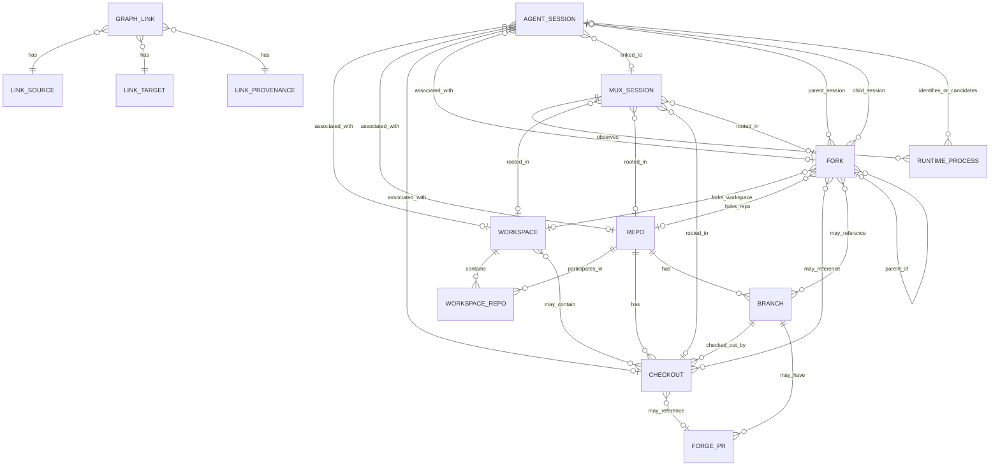

# Conspectus Design

Extract session discovery, mux status, fork/session attribution, and forge
association into a separate binary that complements atelier. The goal is to
reduce atelier's CLI surface area while preserving enough shared code to avoid
duplicating brittle harness and workspace discovery logic.

This document is the north star for breaking Conspectus work into phases,
stories, and implementation tasks. Accepted Architecture Decision Records in
`docs/adr/` provide the detailed rationale behind major data-model decisions;
this design document should stay aligned with those decisions and summarize the
current intended shape.

## Product Goal

Build an opinionated read-only-first status tool for the user's AI work graph.
It should show, in one integrated view:

- agent sessions across all supported AI CLI tools
- associated repos, checkouts, branches, and workspaces
- mux sessions linked to workspaces, checkouts, or agent sessions
- forge PRs linked to branches/checkouts
- fork provenance across context, branch, checkout, and session effects
- basic activity/status signals where each source can provide them

Unlike `atelier status`, this tool should discover sparse records. A row with
only an agent session is valid; so is a row with only a tmux session rooted in a
repo, or a checkout branch with an open PR and no known agent session.

## Design Requirements

- Conspectus is focused on capturing links among ephemeral entities such as
  agent sessions and forks, lifecycled entities such as PRs, and long-lived
  entities such as repositories. It builds those links into a graph that helps
  users navigate the explicit and implicit project structure that emerges from
  using one or more agent harnesses.
- Design data-model-first. The core graph should be stable enough to serve as
  the foundation for the project as it matures. New features and behavioral
  changes should be assessed against the data model first, with implementation
  flowing outward from there.
- Provider-specific reality is allowed at the edges, but the graph shape stays
  provider-neutral. V1 can know about concrete providers such as Atelier, tmux,
  GitHub, and specific agent harnesses without making their private schemas the
  public graph model.
- Conspectus was seeded from the atelier repository, but it is not beholden to
  Atelier's data model. Atelier metadata is an important input source, not the
  shape the Conspectus graph must copy.
- Consumers of the Conspectus graph, including Conspectus's own tabular views,
  must assume the graph is inherently sparse. Many projects will form separate
  cliques, and many useful links will be missing because they cannot be
  auto-discovered.
- Derive as many links as possible from on-disk state and common workflow
  conventions. Conspectus should recognize common workflows without requiring
  users to scatter override files across every repo and workspace.
- Allow global and local overrides to establish, confirm, ignore, or replace
  links, but make overrides rare by improving discovery and convention support.
  User-authored link state should be federated near the repo or workspace when
  the relationship is project-rooted.
- Keep performance caches and other rebuildable indexes outside any given repo
  or workspace. Caches may accelerate discovery, but they must not become the
  only durable representation of user intent.
- Use `Checkout` for the concrete editable working tree of a repo. A checkout
  may be a plain clone checkout, a linked git worktree, a linked worktree whose
  common dir belongs to a bare repo, or a workspace member reached through a
  symlink. Implementation, graph JSON, and user-facing surfaces use checkout
  terminology; git-specific prose still says worktree only for the actual git
  feature.
- Use a loose definition of `Workspace`: a folder where one or more git repos,
  symlinks to repos, or checkouts from repos are present together with the
  intent to make coordinated changes among them. Conspectus may assume
  conventions such as matching branch names when those conventions produce sane
  defaults for workspace-oriented views.
- Conspectus does not own workspace contents beyond the links it tracks. It can
  read workspace metadata, derive relationships from layout, and write explicit
  Conspectus link state on demand, but it should not become a workspace
  materializer.
- Use a loose definition of `Fork`, or multiple fork terms if needed, centered
  on tracking provenance of agent sessions, git branches, checkouts, and related
  state. The model should support context lineage and session lineage without
  assuming every provider implements both in the same way.
- The initial interface is a CLI with two primary purposes: present tabular
  views of the graph built from derived or specified links, and provide commands
  for users to create, read, update, and delete those links.
- Conspectus should expose a machine-readable graph for other tools to consume.
  Future consumers may include interactive TUIs that manage agent sessions,
  connect to mux sessions, or provide workflows similar to agent-deck.
- Support both one-shot CLI invocations and a long-running continuous mode
  that maintains a live graph in the background. The continuous mode is
  optional; the one-shot CLI must remain useful without a server running.
  Graph generation cost must not require the one-shot path to rebuild every
  link from scratch on each invocation.

## Relationship To Atelier

Atelier remains a workspace materializer and policy launcher:

- creates and manages one flavor of multi-repo workspace
- creates checkouts and fork metadata that conspectus can ingest
- owns `atelier.toml` and `.atelier/forks/index.toml`
- generates harness config and wrapper scripts
- launches harnesses through workspace policy

The new binary owns cross-workspace observability:

- global and workspace-local session discovery
- mux session discovery
- forge correlation
- sparse status tables and JSON output
- optional user-defined links between discovered entities

Code sharing should be formal but minimal. Prefer a shared internal library or
small common crates for pure discovery/parsing types. Avoid making the new tool
depend on atelier command modules directly. Leave room to extract the new tool
into a separate repository later.

Likely atelier features to move or delegate over time:

- `atelier session list`
- `atelier mux status`
- forge/PR status integration
- portions of `atelier status` that are really graph observability rather than
  workspace materialization health

## Initial Scope

Start read-only, but design the data model and storage layout for quick follow-up
commands that let users add or remove links manually. Read-only is still the
default for discovery and orchestration; the sanctioned write surface today is
bounded by the mutation envelope in ADR 0087 (user-intent TOML stores,
rebuildable observation sidecars, operator-initiated mux lifecycle, and
Conspectus-owned subprocess launches) with an explicit prohibition list
covering harness-native state, terminal input into live agent panes,
payload persistence, shared/system locations, background mutation, git
mutation, and hook bypass.

Concrete v1 sources:

- harnesses: same support set as atelier for now (`claude-code`, `opencode`,
  `codex`, `aider`)
- mux: tmux as the first implementation
- forge: GitHub as the first implementation
- workspaces: loose workspace groupings and individual git repos/checkouts

Design abstractions for additional harnesses, mux backends, and forge providers,
but do not implement them until needed.

## Core Model

Represent the world as nodes and links.

Nodes:

- `AgentSession`
- `MuxSession`
- `Repo`
- `Checkout`
- `Branch`
- `Workspace`
- `Fork`
- `ForgePr`

Links:

- agent session launched from cwd/checkout
- agent session belongs to workspace or fork provenance
- mux session rooted at path
- mux session linked to agent session
- checkout belongs to repo and branch
- branch has forge PR
- forks record parent/child lineage and link to affected repos, checkouts,
  branches, paths, and agent sessions
- user-declared override or confirmation

Links should carry provenance:

- `discovered`: inferred from a path, transcript, branch, forge query, or mux
  metadata
- `convention`: inferred from naming/path conventions such as fork roots or
  workspace layout
- `declared`: explicitly configured by the user
- `cached`: remembered for performance and invalidated by freshness rules

Graph collection produces candidate `GraphLink` records first. A resolver turns
candidate links into typed relationships for table projections and higher-level
graph views. Manual `declared` links should win over discovered links when they
conflict, but they should not delete the original evidence.

## Entity Relationship Draft

This ERD is a pressure-test target, not final schema. It separates first-class
things the user reasons about from relationship records that carry provenance.

Entity notes:

- `Repo` is the durable git repository identity. A single repo can stand alone
  or participate in one or more workspaces over time.
- `Workspace` is a folder-level working context where one or more git repos,
  symlinks to repos, or checkouts from repos are present together with the
  intent to make coordinated changes among them. A workspace may be inferred
  from layout/convention, ephemeral with no versioned metadata, or persistent
  with metadata describing its intended shape.
- `Workspace` contains repo memberships through `WorkspaceRepo`, not by owning
  repos outright.
- `WorkspaceRepo` is a membership edge because workspace membership may carry
  workspace-local identity, path, role, checkout policy, or whether the member
  is a concrete checkout, symlink, or convention-derived participant.
- `Checkout` is a concrete editable working tree for a repo. It covers plain
  clone checkouts, linked git worktrees, bare-repo-derived worktrees, and
  workspace members reached through symlinks. It normally has exactly one
  current branch, but the branch can change as the checkout changes.
- `Branch` belongs to a repo and may have zero or more forge PRs. Multiple PRs
  are possible across forges, remotes, closed historical PRs, or ambiguous
  branch reuse.
- `Fork` is a polymorphic provider-neutral node for fork-like provenance. It can
  represent context effects, session effects, both, or metadata-only provenance.
  Its meaning is expressed through attributes, provider/source metadata, and
  links to affected workspaces, repos, checkouts, branches, paths, sessions, and
  parent/child forks.
- `AgentSession` is a harness-native session record. It may be global, orphaned,
  repo-rooted, checkout-rooted, workspace-rooted, or fork-associated.
- `MuxSession` is a terminal multiplexer session. It can be linked to an agent
  session and/or rooted in a workspace, repo, checkout, or fork path. When the
  mux provider can observe active-pane process hints, open session files,
  recent session-file activity, descendant harness processes, and
  start-command session keys may refine weak cwd-based session links.
  Process cardinality gates multi-session attribution: a mux with zero or one
  observed non-subagent harness process should have at most one human agent
  session attributed to it; multiple session attributions are allowed only when
  multiple harness processes are observed.
- `RuntimeProcess` is an ephemeral, provider-neutral observation of a process
  relevant to mux/session attribution. It may record PID, parent/root pane PID,
  command, cwd, harness key, depth, observed time, and role. Runtime process
  nodes explain resolver decisions and visualization diagnostics, but they are
  rebuildable operational facts rather than durable identity or user-authored
  intent.
- `ForgePr` is a forge pull request record. GitHub is the only v1 provider, but
  the entity should not encode GitHub-specific assumptions into the graph shape.
- `GraphLink` is the canonical candidate/evidence edge record used for
  discovery, conventions, caches, declared state, diagnostics, and
  machine-readable graph output. It captures source, target or unresolved
  endpoint evidence, relation kind, provenance, confidence, freshness, and
  whether it is ignored or overridden.

Expected cardinality and sparsity:

- A repo can exist with no workspace; a workspace can contain many repos.
- A repo can have many checkouts; a checkout is for one repo.
- A workspace can contain many repo participants, including checkouts, ordinary
  repos, symlinks, or convention-derived members. A checkout may be outside any
  workspace.
- A fork can affect a repo, a workspace, sessions, branches, checkouts, paths,
  or any combination of those. It may create concrete checkouts, reference
  existing checkouts, create or associate branches, represent session lineage,
  or be represented only by provider metadata.
- A fork can have zero or one parent fork and many child forks.
- Session-lineage endpoints may be unresolved. Parent or child session evidence
  can exist before the corresponding `AgentSession` node has been discovered.
- Session lineage edges may be either fork-anchored (sourced at a `Fork` node,
  as in ADR 0005) or directly between two `AgentSession` nodes for
  intra-harness compaction/resume (ADR 0018).
- An agent session can exist without any known repo, checkout, workspace, mux
  session, or PR.
- A mux session can exist without any known agent session.
- An agent session can have many candidate mux links. A resolver may choose one
  preferred mux for a projection, but the graph should preserve all candidates
  for diagnostics and picker-style UIs.
- A mux session may contain multiple agent sessions in practice. The `agent`
  projection renders one row per agent session; the `mux` projection can render
  zero, one, or many linked agent sessions per mux.
- Mux runtime state is distinct from agent-session linkage. For tmux, mux
  discovery records whether the session currently has an attached tmux client;
  TUI mux-row glyphs use that client state, while linked agent sessions render
  as row text or child rows.
- A branch can have zero, one, or many PR records. The table view should prefer
  open PRs and report ambiguity rather than collapsing it silently.

Fork effect matrix:

| Context Effects | Session Effects | Meaning |
| --- | --- | --- |
| yes | yes | Heavyweight fork-like workflow. A single `Fork` records both context provenance and session lineage evidence. |
| yes | no | Context-only fork-like workflow for pure git, branch/checkout experiments, or pre-staging later agent work. |
| no | yes | Session-only fork-like workflow for parallel non-colliding work, read-only agents, or multiple agents sharing one context. |
| metadata only | optional | Provider records a fork root or operation but no concrete context or session endpoints have been discovered yet. |
| no | no | Noop. Do not support or persist this as a fork node unless provider metadata supplies meaningful provenance. |

Lifecycle transitions:

- Single repo to workspace: grouping one or more repos, symlinks, or checkouts
  under a common folder creates a `Workspace` plus `WorkspaceRepo` membership.
  Existing repo-local links remain valid and can be shadowed by workspace-local
  links when more specific.
- Workspace to standalone repo: removing or ignoring a workspace should not
  delete repo, checkout, branch, agent session, mux session, or PR nodes. The
  graph should degrade to repo/checkout associations.
- Context-like fork: forking a repo or workspace creates a `Fork` node and may
  create checkouts, reference existing checkouts, create or associate branches,
  record a fork root, or record only provider metadata. Existing sessions rooted
  in those paths may gain fork associations on the next discovery pass.
- Session-like fork: forking an agent session creates `parent_session` and/or
  `child_session` link candidates from the `Fork`. It may reuse the same
  checkout when no context effect was requested. Missing endpoints remain
  unresolved evidence until a concrete `AgentSession` is discovered or declared.
- Combined fork: a heavyweight fork-like workflow creates one `Fork` node with
  both context-effect links and session-lineage links.
- Context effects without session effects are supported for pure git workflows.
- Session effects without context effects are supported for parallel work that
  will not collide, read-only agents, or multi-agent setups where separate
  session state is useful without a new checkout.
- Fork with no context effect, no session effect, and no meaningful provider
  provenance is a noop; do not create a graph node.
- Fork back to ordinary checkout: if fork metadata disappears but the checkout
  remains, sessions should keep their checkout/repo links and lose only the
  fork lineage unless a declared link preserves it.
- Orphan session to rooted session: when a later discovery pass finds cwd,
  transcript, mux, or declared metadata, the same `AgentSession` can gain links
  to repo/checkout/workspace/fork nodes without changing session identity.
- Discovered link to declared link: user confirmation or override should create
  a durable `GraphLink` with `declared` provenance, leaving the discovered link
  visible in detailed diagnostics.

## Discovery Strategy

Default discovery should be useful without scanning the user's entire home tree.
The sane default is:

- read home-global agent-specific state/config directories for supported
  harnesses
- read mux sessions from the configured mux backend
- read fresh daemonless harness hook spool records from the user's Conspectus
  state directory when present, using them as current-session evidence rather
  than durable user intent; when the daemon is available, hook evidence is
  ingested directly into the in-memory graph and persisted via `graph.bin`
- read read-only harness state and log databases when the harness maintains
  them, using stable indexed fields to discover sessions and to derive live
  mux attribution; for Codex this is the `state_*.sqlite` threads/lineage
  reader plus a `logs_*.sqlite` linker that resolves the active thread for
  each live Codex pid by parsing `process_uuid = pid:<os_pid>:<uuid>`
  within a 15-minute freshness window (ADR 0048)
- inspect cwd and explicitly configured scan roots
- read known workspace metadata from supported providers when a workspace is
  discovered
- inspect git metadata for discovered repos/checkouts
- probe distinct agent-session and mux-session cwd paths read-only to backfill
  repo, checkout, branch, and workspace context even when those paths are
  outside the launch cwd or configured scan roots
- query GitHub for PRs associated with discovered repo/branch pairs

Discovery should prefer direct on-disk evidence first, then provider metadata,
then common conventions, then user-declared overrides. Conventions such as
matching branch names or known fork roots should create useful candidate links,
but they should carry provenance and confidence rather than silently becoming
facts.

Hook sidecar records are local, rebuildable observations written by opt-in
harness hooks outside project trees. They may refine mux/session attribution
when fresh, but stale records should not override active process evidence.
Conspectus must not inject terminal input or slash commands to ask an agent for
its current session id.

Runtime process observations are likewise rebuildable discovery output. Per ADR
0047, Conspectus should model them as first-class graph nodes when process
evidence explains mux attribution, subagent filtering, server/proxy behavior, or
graph diagnostics. Default human projections can hide process nodes, but graph
JSON, node detail, and visualization exports should preserve them.

Read-only harness state and log databases are equivalent rebuildable
observations owned by the harness itself rather than by Conspectus.
Conspectus opens them with read-only flags and `query_only` enabled, and
treats their evidence on the same freshness rules as hook sidecars: fresh
log-derived current-session evidence outranks command/fd evidence and
demotes stale launch-argv candidates for the same mux; stale rows are
ignored for active attribution (ADR 0048).

Payload access follows the three-tier invariant in ADR 0086.
Attribution and identity readers (Tier 1) never touch payload
columns; operator-facing content features like the sessions
view's preview column and the native transcript viewer (Tier 2,
ADR 0013 / ADR 0023 / ADR 0052) read payload but cap and
normalize it and only surface it under an operator gesture;
hook sidecars and rebuildable state records (Tier 3, ADR 0028)
stay payload-free.

Additive discovery:

- allow users to opt in workspace/repo roots manually
- support autodiscovery from known workspace locations or config files
- support a future "bootstrap" mode that recursively scans selected roots,
  including `$HOME` only when explicitly requested

Avoid default behavior that recursively walks all of `$HOME`.

In continuous operation mode (see below), each discovery source runs on
its own refresh cadence rather than as a single end-to-end scan. Provider
abstractions stay identical to the one-shot path; the difference is in
how often each provider is invoked and how its output is merged into the
existing graph.

## State And Persistence

Track the minimum necessary state to tie entities together. Persist user intent;
derive everything else from on-disk state, provider metadata, conventions, or
rebuildable caches whenever possible.

Project/workspace-local state is preferred for durable relationships:

- user-declared links for sessions rooted in a workspace should live as close to
  that workspace/project as possible
- mappings should be suitable for version control when the workspace state is
  versioned
- this preserves the future path toward portable, version-controlled agent
  sessions and persistent cross-machine session IDs

Global state is acceptable for:

- global/orphan sessions that do not belong to a workspace
- user-wide scan roots and ignore rules
- performance caches
- cached forge metadata
- last-seen indexes

Hybrid rule of thumb:

- if an entity is rooted under a workspace or a git repo with a local
  metadata area, store durable declared links locally
- if an entity is home-global or cannot be tied to a project, store declared
  links globally
- caches and rebuildable indexes should be global even when durable
  declarations are local, so cache rebuilds do not dirty project trees or lose
  user intent

Local and global state locations:

- persistent workspace: `.conspectus.toml`
- standalone repo: `.conspectus.toml`
- provider-specific workspace metadata may point at an alternate local state
  file when that provider owns a private metadata directory
- global config: `$XDG_CONFIG_HOME/conspectus/config.toml`
- global cache/index: `$XDG_DATA_HOME/conspectus/`

Local declared-link files should be created only on demand, when the first
manual link/ignore/override command needs to persist user intent. Read-only
discovery should not dirty a repo or workspace.

Durable declared state should use TOML for the first implementation. The files
need to be reviewable, hand-editable, and reasonable to version-control. A
future SQLite or line-oriented store is acceptable for caches and indexes, but
should not become the only representation of user-authored relationships unless
there is a clear migration story back to portable project-local state.

Do not make session portability part of this refactor, but avoid storage choices
that would make portable session IDs or version-controlled session state harder.

## Manual Link Commands

Post-v1 commands should let users create, read, update, and delete
relationships that discovery cannot infer:

- link/unlink mux session to agent session
- link/unlink GitHub PR to checkout or branch
- link/unlink agent session to workspace, repo, checkout, or fork
- mark session/repo/mux rows ignored
- confirm or override a discovered relationship

These commands should write declared links to the nearest appropriate local or
global store according to the persistence rules above.

## Session Aliases

Conspectus supports operator-chosen display names for agent sessions as a
Conspectus-owned overlay on top of the adapter-populated `title` field.
Aliases live in a sibling `[[aliases]]` TOML table in the same local/global
config files as declared links, follow the same store-selection and
provenance rules, and are applied at projection time with precedence
`alias > title > id-suffix`. The harness-native title is never mutated; the
alias-only model works uniformly across every harness, including those with
no writeable title field. Renaming a muxed agent session also renames the
tmux session in lockstep by default. ADR 0029 captures the schema, mux
node-id stability rule, and lockstep contract. ADR 0030 settles the shared
TUI text-input primitive used by the rename overlay (and reused by the
search overlay and inline mux-picker).

## Session Pins

Per ADR 0057, Conspectus supports user-authored **Session Pins** as
the surface that replaces agent-deck's "new" workflow. The
[operations guide](operations.md#session-pins) documents the command
and TUI surface in detail. A pin is a
declared `(harness, cwd, display_name, mux)` tuple that

- persists in a sibling `[[pins.entries]]` TOML table alongside
  `[declared]` (ADR 0014) and `[aliases]` (ADR 0029), in the same
  local/global config files. Local pin stores are aggregated from the
  startup scan roots and from observed graph CWD/root paths so project
  pins remain visible regardless of the operator's launch directory,
- renders as a first-class row in the sessions and mux views whether or
  not a live session currently realizes it,
- binds 1:1 at resolve time on the **mux native name**
  (`pin.mux.name`, optionally namespaced by an explicit `mux.socket_name`
  for tmux's `-L <name>` server isolation): the resolver looks up
  the live `MuxSession` with that `(socket, name)` pair, then
  identifies the harness session via the existing mux-to-agent-
  session attribution pipeline (ADR 0006 / ADR 0028 / ADR 0046 /
  ADR 0047 / ADR 0048). Intra-harness lineage (ADR 0018) carries
  the binding through `/compact` / `/resume` transparently. Cwd is
  a launch parameter and a drift sanity check, not the
  discriminator — at realistic densities (the dev tree has 47+
  historical sessions at one cwd) cwd alone is too weak to
  attribute uniquely. Per ADR 0102 a session realizes at most one
  pin: sessions are assigned across pins by the resolver's session ↔
  mux evidence order, a pin's previous binding is kept only as the
  weakest fallback candidate, and a pin that loses its only session
  reads `PinStaleMux` naming the pin that holds it.
- launches a fresh `tmux [-L <socket>] new-session -s <mux.name>
  -c <cwd> <argv>` via the `TmuxRunner` mutation surface, then hands
  the terminal off through the existing P8-010 exec-replace path.
  When the mux exists but the harness has exited (`PinStaleMux`),
  launch injects the command into the existing pane via
  `tmux send-keys` rather than recreating the mux. When pane-process
  evidence shows the harness still running there, launch attaches
  without typing anything (ADR 0102, ADR 0028). Sessions Conspectus
  creates keep a pane that exits non-zero, and launch confirms the
  harness survived its first moments: a resume the harness rejects
  falls back to a fresh launch, and a fresh launch that dies reports
  the harness's own output (ADR 0103). Non-default tmux
  sockets (`mux.socket_name = "<name>"`) launch and attach correctly in
  v1; discovery-side enumeration of non-default sockets is a
  deferred follow-up, so until that lands, non-default-socket pins
  render as `PinUnbound` even when their tmux session is live.

Per-harness default launch argv lives on `HarnessAdapter::launch_argv`.
The pin's `display_name` doubles as the bound agent session's alias
overlay (ADR 0029 precedence) and as the initial tmux session name;
renames apply the ADR 0029 lockstep contract. The binding is *not*
persisted as resolver-canonical state — it is recomputed every
discovery pass from live evidence plus the pin declaration, mirroring
how ADR 0005 unresolved-endpoint evidence resolves opportunistically.
Per ADR 0058, the most recent fresh binding *is* recorded to a
per-pin sidecar under `$XDG_CACHE_HOME/conspectus/pin-bindings/` so
that a subsequent `pin launch` after the mux dies can splice
`HarnessAdapter::resume_argv(<session>, <cwd>)` into the launch
instead of starting a fresh session. The sidecar is a rebuildable
cache, not authoritative state; the resolver never reads it. The
resolver emits four pin-specific diagnostics — `PinUnbound`
(optionally carrying a `last_session` hint when the sidecar has
one), `PinStaleMux`, `PinAmbiguous`, `PinDrift` — each mapped to a
specific TUI affordance and CLI escape hatch (`pin bind`, `pin
rebind`, `pin adopt`); ambiguity overrides reuse the ADR 0014
declared-link surface rather than introducing a new persisted binding
type.

Per ADR 0084, pins also project into the graph as first-class
`PinNode`s with stable `pin:<id>` node ids. The TOML entry remains the
source of truth and `GraphSnapshot::pins` remains the CRUD sidecar, but
each resolved snapshot rebuilds a pin node carrying declaration fields,
store lineage (`provenance`, `store_path`), and the current binding.
Pin-specific candidate links connect the node to its intended mux
(`pin_targets_mux`, unresolved when the mux is absent) and to the
realizing agent session when bound (`pin_realized_by_session`). TUI pin
rows select the pin node itself; bound/stale detail fields link onward
to the related session or mux rather than pretending the pin row is that
entity.

Pinned work should also project into session- and mux-shaped surfaces
before the first launch. An unbound pin represents an intended mux and
an intended next agent session even when neither live entity exists yet;
TUI session and mux views should therefore be able to show placeholder
session/mux rows introduced by the pin while retaining the separate
`PinNode` as the authored declaration and source of launch/store
lineage. Once the mux or session is observed, those placeholders should
resolve to the real graph nodes without changing the user's row-level
mental model.

Pins declare the *next* logical session; the H-AGENTMUX adapter
workstream extracts evidence from *existing* agent-mux orchestrators
(agent-deck, dmux, workmux, agent-of-empires). The two surfaces are
complementary — adopting pins does not block, replace, or require
the H-AGENTMUX adapters.

CLI surface: `conspectus pin create|list|show|rename|rm|launch|attach|bind|rebind|adopt`.
TUI surface: pin rows appear in the sessions and mux row trees;
`Enter` launches when unbound and attaches when bound; `R` renames
with lockstep; `N` / `B` / `b` / `A` / `Delete` are direct shortcuts
for create / rebind / bind / adopt / remove, and `p` opens a
dedicated Pins management modal (separate from the ADR 0031 Controls
overlay) that surfaces every action with selection-aware defaults.
ADR 0057 records the schema, mux-anchored binding rules, diagnostics,
read-only invariants, and the deferred questions (Windows/non-tmux
launch, multi-harness pins, pre-launch hooks, env overrides,
atelier-fork auto-suggestion). ADR 0058 records the continuity
sidecar and per-harness `resume_argv` story.

## Worktree Management

Operators running several agents against one repo lean on git
worktrees — one linked working tree per branch / task / agent. A
worktree is not a new entity: it is a `Checkout` (the concrete
editable working tree of a repo, ADR 0026), distinguished from a plain
clone by source metadata (linked vs primary, the branch it checks out,
locked/prunable status). Discovery already surfaces linked worktrees
as checkouts; management adds create / list / remove on top.

Management flows through a **pluggable worktree backend seam**
(ADR 0092) with a strict read/mutate split:

- **`list` is read-only and always available.** Every backend
  enumerates a repo's worktrees; the built-in thin `git` backend does
  this via `git worktree list --porcelain` (a read command).
- **`create` / `remove` are mutation and delegated.** Conspectus
  never runs `git worktree add/remove` itself — ADR 0087 prohibition 6
  (never mutate git state) stays absolute. Instead, mutation-capable
  backends are external dedicated tools; the v1 rich backend is
  [`worktrunk`](https://github.com/max-sixty/worktrunk), which
  Conspectus invokes as a Conspectus-owned subprocess launch
  (ADR 0087 category 4). The built-in `git` backend deliberately stops
  at read/list.

Backend selection mirrors the mux-backend / forge-adapter registries
(ADR 0089): a `[worktree] backend` config key plus `PATH`
autodetection of `worktrunk`. When no mutation-capable backend is
configured, create/remove are hidden (TUI) or error with a clear
message (CLI) rather than falling back to raw git. CLI surface:
`conspectus worktree list` (read) and `worktree new` / `rm`
(delegated). TUI create/remove are operator-initiated, menu-first, and
available only when a mutation backend is present. ADR 0092 records the
seam, the envelope placement (prohibition 6 unchanged), the
`Checkout`-not-new-node modeling decision, and the deferred questions
(worktrunk argv mapping, refusing removal of a worktree hosting a live
session).

On top of the seam, the worktree epic adds the lifecycle gestures that
bracket a stream of work. **Merge back & close** lands a worktree's
branch and tears the worktree down. **Close-down** is the compound
inverse of creation: it terminates the mux/agent sessions rooted in the
worktree (a two-phase graceful-`SIGTERM`→hard `kill-session` sanctioned
by ADR 0093), lands or discards the branch, removes the worktree, and
drops the pins declared there — one gesture on the CLI (`worktree
close`) and the TUI (`X` / menu). **New-stream** is the creation side:
a pin may be *worktree-backed* (`[worktree] branch`), and its worktree
is realized at launch — created from the repo default and entered
alongside the mux + agent — rather than at pin-write time, keeping the
declaration pure (ADR 0094). The `N` key opens the create form with the
worktree toggle pre-enabled.

Maintenance rounds out the surface: **prune** delegates to worktrunk's
`step prune` (remove worktrees already merged into the default branch)
— a merged-cleanup distinct from git's stale-admin prune that the
`prunable` flag reflects — via CLI (`worktree prune`) and a repo-level
menu action. Lock/unlock are intentionally absent: worktrunk exposes
neither, and worktree mutation stays routed through worktrunk (ADR
0092) rather than raw git. **Reveal** actions jump the selection to the
checkout containing a session, or to a worktree's first live session —
read-only graph navigation, no backend.

## Mux Lifecycle

Conspectus's operator-initiated mux mutations (ADR 0087 category 3) are
four separate creation flavors plus rename, attach, and teardown:

- **Bare mux** (ADR 0095) — a plain tmux session with no pin, no
  agent, no worktree. `conspectus mux new <name> [--cwd <path>]` on
  the CLI; lowercase `n` in the TUI opens a create form. The
  operator gets a shell in the requested cwd; nothing is persisted
  and no argv is injected (ADR 0028). The bare session appears in
  discovery on the next refresh and can later be adopted as a pin
  (`pin adopt`) if the operator wants durable declaration.
- **Mux launch** (ADR 0096) — an ephemeral harness session in a
  fresh mux, no pin persistence. `conspectus mux launch <harness>
  --name <mux-name> [--cwd <path>]` on the CLI; the `m`-keyed Mux
  action menu in the TUI opens a parameterized launch-spec form
  (ADR 0097) for it. The mux and its harness session appear in
  discovery next refresh; `pin adopt` remains the after-the-fact
  persistence path when the operator changes their mind.
- **Pin launch** (ADRs 0057 / 0058) — a `pin launch` (or `Enter` on
  an unbound pin row) starts a tmux session running the pin's
  harness argv, spliced with `resume_argv` when a continuity
  sidecar applies. Resume tokens are inserted after the harness
  binary inside the pin's argv, so wrappers and launch options
  survive (ADR 0098). Distinguished from mux launch by durable
  `[[pins.entries]]` persistence, alias overlay, and resume
  continuity.
- **Worktree stream** (ADR 0094) — a worktree-backed pin realizes
  its branch's worktree at launch and then runs the pin-launch
  path inside the fresh worktree cwd. The `N` TUI shortcut opens
  the pin create form with the worktree toggle pre-enabled. Mux
  launch (ADR 0096) also exposes the worktree toggle, materializing
  the worktree without writing a pin.

Rename (ADR 0029, with pin-lockstep), attach (via `MuxBackend`), and
teardown (ADR 0093, two-phase graceful → hard `kill-session`) round
out the surface. All flavors share the `MuxBackend::new_session`
/ `attach_session` / `kill_session` primitives (ADR 0089) — the
distinctions are in what the caller passes as argv and whether a pin
or worktree wraps the call. The pin-create and mux-launch TUI forms
share a launch-spec form primitive (ADR 0097) with per-caller
wrappers that fix mode at open time; no in-flow toggle switches
between persistence shapes.

## Status Views

Tabular views are projections chosen by row type, per ADR 0021:
`conspectus table <rows>`. The `sessions` table is AgentSession-oriented: one
row per discovered agent session, with mux information shown as a sparse
joined column when a mux session can be linked. This avoids pretending agent
sessions and mux sessions are the same kind of thing.

The row types are:

- `sessions`: one row per agent session, with linked mux data in sparse
  columns
- `mux`: one row per mux session, with linked agent data in sparse columns
- `union`: rows for both node types, with a `tool` / `kind` column
- `prs` and `forks`: one row per forge PR or fork

Per-row-type configuration lives under `[table.<rows>]` in TOML (for example
`columns = [...]`). The earlier `conspectus session --projection` command and
its `[session] projection` key are retired; the key is recognized only to
print a pointer to the new schema.

Future TODO: if no agent sessions are auto-discovered but mux sessions are
available, consider falling back to the MuxSession-oriented view for that run,
with an explicit note.

Candidate columns for the default AgentSession-oriented table:

- agent/tool
- session id
- activity/status
- mux session
- repo/checkout
- branch
- workspace
- fork
- lineage
- PR
- last activity
- provenance/confidence

Machine-readable output should preserve the graph shape directly: nodes, links,
provenance, and source metadata. The table can be a projection over that graph.

Workspace-aware projections should treat workspaces as an overlay context, not
as a replacement for repo or checkout links. By default, sessions rooted in a
workspace member may appear under both the workspace and the underlying
checkout. A workspace visibility setting should support at least "include
workspaces" and "exclude workspaces" so users without atelier, agent-deck, or a
similar workspace concept can keep the view checkout-centric.
The first implementation can expose this as JSON, but the interface should be
treated as a graph API for future tools rather than a table serialization.

Machine-readable output should distinguish raw candidate links from resolved
relationships. Candidate links preserve discovery evidence, provenance,
confidence, freshness, ignored/overridden state, and unresolved endpoint
metadata. Resolved relationships are the projection chosen by the resolver for a
given graph snapshot.

Declared relationships should be authoritative but not destructive:

- local declared links win over global declared links
- declared links win over discovered links
- fresh discovered links win over cached links
- conflicts are displayed as status, not treated as fatal errors
- candidates that agree with the winner's target corroborate it; only
  candidates naming a different target compete, and only those raise a
  conflict (ADR 0107)
- detailed output should show all candidate links and their provenance

Fork-aware views should:

- read fork metadata from supported providers when available
- show context-effect lineage and session-lineage evidence separately when a
  single `Fork` has both kinds of links
- show one provider-visible `Fork` when a single user action affected both
  context and session state
- associate sessions rooted in fork paths or fork-associated session state
- associate mux sessions rooted under fork paths
- fall back to path/branch/session conventions when provider metadata is
  unavailable

Mux-aware views should:

- preserve all candidate agent-session-to-mux links
- select one preferred mux link per agent-session row when evidence supports it
- show ambiguity when multiple non-ignored candidates remain
- allow mux-oriented views to show zero, one, or many linked agent sessions

### Filtering And View State

Settled by ADR 0031.

Interactive and static views share a single `RowFilter` predicate type
so the same narrowing is reproducible at the CLI and in the TUI. v1
filter dimensions are `harness` (set membership), `max-age` (recency
window against `last_active_epoch`), and `mux-state` (attached /
ambiguous / unmuxed). Free-text "contains" filtering is intentionally
deferred to the `/` fuzzy search overlay; structured filters narrow by
structure, `/` ranks within the filtered set.

In the TUI, filter / grouping / selection / expanded-set / left-scroll
state is **per view**. Sort order is **global**. Switching views and
back returns each view to its prior state. Each view has its own
grouping enum (`SessionsGrouping`, `MuxGrouping`, `UnionGrouping`,
`PrsGrouping`, `ForksGrouping`) and the same `Grouping` dispatch type
backs config, CLI flags, and TUI controls.

The sessions view defaults to `grouping = "graph"` so the primary switcher
shows the richer topology: it includes workspace containment when known and
nests resolved `parent_session` lineage under parent sessions across harnesses.
`grouping = "workspace"` (ADR 0065) renders a workspace-first slice — every
discovered workspace gets a header (even with no active sessions) and (A)-class
sessions group under it; (B)-class and unaffiliated sessions fall into the
synthetic Ungrouped bucket. This grouping replaced the dedicated
`View::Workspaces` from ADR 0062. `grouping = "repo"` remains available for a
location-first view. The sessions view also supports `grouping = "none"`. This
renders a flat, table-like session list rather than workspace/repo/checkout
group rows. The flat list carries an inline project-name column before the
preview text and uses recency order; hierarchy sorting is not applicable
without group rows.

Every capability in this surface is reachable through a navigable
**Controls overlay** (sections for view, grouping, filters, sort).
Single-key accelerators are layered on top and surfaced in the
overlay's hint footer so they remain discoverable rather than
required.

Configuration moves to `[tui.views.<name>]` sub-tables. The original
`[tui].sessions_grouping` key remains supported as a deprecated alias
until a follow-on ADR retires it.

### TUI Detail Navigation

The right-panel detail view is a focused node inspector and graph
relationship explorer (`T8-027` – `T8-031`), not a recursive report
renderer. The full layout, locked decisions, and per-kind field set
live in [`docs/tui-detail-mockup.md`](tui-detail-mockup.md); this
section captures the implemented contract.

Each selected node detail has three conceptual regions:

- **Node** zone: stable, short fields for the focused node only (`id`,
  label/name, cwd, status, important timestamps, and the high-signal
  attributes per the mockup's Core-Summary fields reference).
- **Related** zone (ADR 0074, ADR 0107): one row per neighbor, read as
  `<directional verb> <kind glyph> <neighbor>` and sorted by neighbor
  kind, verb, then label. Neighbors the resolver picked sit in a flat
  validated list. Neighbors it did not pick (different-target
  competitors, alternates, no-winner slots) and unresolved-evidence
  stubs sit under one collapsed `Other` header. A neighbor appears in
  exactly one zone; several producers agreeing on the same neighbor is
  one row, not a conflict.
- **Preview** zone: the neighbor's core fields, an `edge` row
  summarizing the representative link's provenance, confidence, state,
  and resolver verdict (`resolves` / `alt of <relation>` /
  `conflict`), and an `evidence` list of every link backing the row.

For a muxed selection the Preview zone shows the pane's live capture
instead (ADR 0025), bottom-anchored on its last non-blank output. A
wrap mode fits it to the pane's width: `smart` (the default) wraps
content but truncates rules, borders, and padding; `plain` wraps
everything; `none` keeps tmux's layout and clips. It's set by
`[tui] preview_wrap` and the controls overlay (ADR 0106).

Traversal through N levels of the graph is explicit rather than
inline. With the right pane focused:

- `j` / `k` walk the cursor through Node fields, validated rows, the
  `Other` header, then its children when expanded.
- `Enter` is the universal "do the obvious thing" key: on the `Other`
  header it toggles expansion; on a neighbor row it drills into the
  neighbor and pushes a breadcrumb hop.
- `e` is the explicit expand/collapse accelerator for the `Other`
  header.
- `Backspace` reads as a general "go back" gesture: it pops the
  breadcrumb stack and restores the prior focused node along with the
  cursor and expansion state saved with it. Once the stack is empty,
  the first `Backspace` surfaces a status hint ("press Backspace again
  to return to the left pane") and a second consecutive `Backspace`
  shifts focus from the right pane back to the left tree. Any
  intervening action (navigation, focus cycle, …) cancels the arming
  so the next `Backspace` re-prompts instead of jumping straight to
  the focus shift.
- `o` opens the full untruncated value of the cursor row in a centered
  modal — used for `cwd`, `command`, `url`, `last_message_preview`,
  and other rows that carry `(truncated · o)` hints.

Unresolved-evidence stubs render as placeholder rows whose `Enter` is
inert in v1 (see follow-up `T8-032`).

This supersedes the recursive inline linked-detail expansion (`e` =
expand-in-place) the pane used to carry. Inline expansion made
one-hop links visible, but it did not scale once muxes, runtime
processes, sessions, repos, forks, and PRs repeated nested sections.
The new layout preserves orientation, keeps the focused node's own
facts visually distinct, and uses explicit navigation for graph
depth.

### Graph-to-View Slicing

The producer pipeline discovers and resolves a typed
`GraphSnapshot`; consumers read from that snapshot. Daemon-
connected TUI and CLI receive an owned snapshot decoded from
the daemon's serialized cache (`client_snapshot` → rkyv
deserialize per ADRs 0082/0083). Daemonless consumers cold-
rebuild the same snapshot in process.

The output renderers
(`src/output/{agent,mux,union,prs,forks,node_show,table}.rs`)
and the TUI row builders (`src/tui/rows/*.rs`,
`src/tui/{detail,explorer}.rs`) consume `&GraphSnapshot`
directly and iterate the typed model. `src/query/` and the
internal `materialize_snapshot` SQLite engine are gone
(P11-011b/c/d, ADR 0082); `rusqlite` survives only for
provider-owned state such as OpenCode's on-disk read path.

Filter, grouping, selection, and row-view-model assembly stay
in Rust. The Rust resolver remains the source of truth for
relationship selection (ADR 0041).

### Graph Visualization Exports

Per ADR 0050, `conspectus graph` exports two visualization formats in
addition to JSON: `--format dot` (Graphviz for static inspection) and
`--format html` (single-file self-contained interactive explorer built
on inlined Cytoscape.js). Both render the same resolved
`GraphSnapshot` and named replay scenarios.

The v1 visual encoding is provider-neutral: node color/shape is keyed
on `NodeKind`, edge style on `RelationKind`, edge weight/opacity on
`Provenance`. Provider identity (atelier, tmux, github, harness key,
mux backend) is carried in attributes and the HTML inspector panel
rather than in bespoke node shapes. Provider-keyed overrides on top
of the base palette are deferred, not prohibited; they ride on the
shared `[theme]` table once a concrete use case appears. Candidate `GraphLink` evidence and
resolved relationships are both available — the HTML view toggles
between them; DOT renders both with distinct styling by default and
collapses on `--candidates exclude`. `RuntimeProcess` nodes (ADR 0047)
and unresolved-endpoint stubs (ADR 0005 / ADR 0018) render by default
and are filterable. Emission is deterministic so the GV-002 / GV-003
snapshot tests are stable. A live HTML view hosted by the continuous
server (ADR 0038) is an explicit follow-on left to a later ADR.

Theming is planned to grow a shared `[theme]` table for the per-`NodeKind`
colors and per-`Provenance` modifiers the visualizer needs and that the TUI
does not yet expose, with `[html.theme]` as the surface-specific override.
Neither table is implemented yet: the HTML export uses its built-in palette,
and `[tui.theme]` remains the only theming config.

Cytoscape is the chosen v1 library but is treated as a swappable
implementation detail. The Rust renderer emits a library-neutral JSON
payload; a single JS driver module fronts every Cytoscape call;
graph-traversal primitives (BFS, depth-N, upstream/downstream) run
over the neutral payload; and the stylesheet is expressed in terms of
`NodeKind` / `RelationKind` / `Provenance` and translated to
Cytoscape's idiom at load time. A future swap to a different library
(e.g. AntV G6 with Graphin if a React-based explorer chrome is later
warranted) is a contained driver rewrite, not a full rewrite.

## Continuous Operation Mode

Conspectus supports two operation modes:

- **One-shot CLI**: each invocation either fetches a resolved
  snapshot from a running daemon or performs a cold-rebuild
  discovery pass, renders output, and exits. This is the default
  invocation shape.
- **Continuous server (`conspectus serve`)**: a long-running
  process holds the resolved `GraphSnapshot` in memory and
  schedules per-provider-class refreshes on configurable
  intervals. CLI invocations and the TUI talk to the server when
  one is running and fall back to in-process discovery otherwise.

The server uses interval-based polling per discovery source as
its baseline, with filesystem-watcher wake-ups for low-latency
signals (harness state directories per ADR 0081; git refs and
`.conspectus.toml` are future extensions).

Defaults skew toward "responsive but quiet": short intervals for
cheap local sources, longer intervals for expensive ones.
Concrete starting points (configurable per provider class):

- harness state directories: a few seconds
- mux backends: a few seconds
- git repo/checkout probes: tens of seconds
- forge metadata (e.g. `gh pr list`): minutes

Provider failures are isolated. A broken `gh` binary,
unreachable mux backend, or unreadable harness state directory
must not halt unrelated providers. Each provider carries its own
success/failure status, last-refresh timestamp, and back-off,
surfaced via the daemon's per-class scheduler state and the
`conspectus status` command.

The server lifecycle is user-managed (systemd user unit, launchd
agent, or a manual `conspectus serve &`). The CLI must not
auto-spawn a daemon on regular invocations; absence of a server
is not an error.

Transport between the CLI and the server is the Unix-domain
socket at `$XDG_RUNTIME_DIR/conspectus/server.sock` (mode 0600)
with length-prefixed JSON framing per ADR 0038 (as amended by
ADR 0082). The socket commands are:

- `ping` — wire-shape probe.
- `status` — per-class scheduler observability.
- `refresh` — force a daemon-side cold rebuild (whole graph or
  a single class via `args.class`).
- `snapshot` — return the serialized resolved snapshot. The
  daemon's cycle output is cached as serialized bytes;
  consumers decode via `snapshot::from_bytes` and use the
  resulting `GraphSnapshot` directly.

The `conspectus refresh`, `conspectus status`, `conspectus
table` / `node show` / `graph` CLI commands and the TUI all
prefer the daemon path when reachable and fall through to
in-process discovery otherwise. Both paths surface which one
they took so operators can see at a glance whether the daemon
is responding.

The "absence is not an error" guarantee is structural rather
than incidental: every reader can either talk to the daemon
*or* read the on-disk `graph.bin` artifact (see "Graph Snapshot
Persistence" below) *or* cold-rebuild. The daemon being down
just collapses the resolution chain to the last two options.

Configuration extends the existing TOML config with a
`[server]` table plus per-provider interval keys; specific keys
and defaults belong in ADR 0038. The same `[server.intervals]`
table doubles as the one-shot CLI's warm-start TTL per ADR
0079.

## Graph Snapshot Persistence

The canonical persisted graph artifact is a single zero-copy
binary file at `$XDG_DATA_HOME/conspectus/graph.bin` per ADRs
0082 and 0083. The file carries a 32-byte fixed header
(`CONSPECT` magic + `format_version` + `payload_len` +
reserved) followed by an rkyv archive of the resolved
`GraphSnapshot`. Atomicity is the standard POSIX
write-tmp-plus-rename idiom; POSIX inode liveness guarantees
concurrent readers holding the old file's mapping keep seeing
the old data until they drop it.

- The artifact is never written inside project trees.
- There is no schema migration chain. A `format_version`
  mismatch on read triggers a cold rebuild rather than an
  in-place upgrade; this is acceptable because the artifact is
  a cache and cold rebuild is fast.
- `bytecheck` validates the on-disk payload end-to-end before
  any reader accesses an archived field. Validation runs on
  daemonless / warm-start reads; daemon-served bytes skip
  validation (the daemon trusts itself).
- The `JSON` export at `conspectus graph --format json`
  survives as the documented inter-tool boundary for cases
  where humans or `jq` need to inspect graph state; the rkyv
  file is explicitly a Rust-internal cache.

The daemon holds two in-memory caches that move in lockstep
with the on-disk file:

- `SnapshotState`: the live `GraphSnapshot` the per-class
  scheduler reads as its next-cycle prior. Replaces the
  previous "read prior from `graph.sqlite`" pattern — the
  daemon never reads its own on-disk artifact during normal
  operation.
- `SnapshotBytes`: the serialized form the socket `snapshot`
  command serves verbatim without re-serializing per
  connection.

Below the snapshot, discovery adapters memoize expensive reads
(git probes, per-file session scans, mux and forge fragments)
in a `DiscoveryCaches` value owned by the caller. The daemon and
the TUI keep one for their lifetime; one-shot commands start
empty (ADR 0099).

On startup the daemon attempts to seed `SnapshotState` from
`graph.bin` (warm-restart per P11-009). Failure on any leg
(missing file, version mismatch, validation failure) falls
through to first-cycle cold-rebuild semantics.

Each node, candidate link, and resolved relationship carries
the producing provider's stable identifier and a freshness
timestamp. This provenance is what makes partial eviction
possible: the unit of refresh is a single provider's slice of
the graph. Re-running a provider class on its tick evicts the
class's slice from the in-memory prior, runs only that class's
discovery providers, merges the result, re-resolves, and
publishes the updated snapshot to both in-memory caches and the
on-disk file via a single atomic-rename write.

The one-shot CLI's resolution chain (P11-008 + P11-011a):

1. If `conspectus serve` is reachable on the socket, request
   the resolved snapshot via the `snapshot` command and
   return. Skips discovery + resolve entirely.
2. Otherwise, run discovery with an empty prior (cold
   rebuild), resolve, and write the resulting snapshot to
   `graph.bin` so the next daemon cycle or future warm-start
   has the artifact ready.

`--refresh` bypasses (1) so the operator-typed "ignore the
daemon, rebuild from disk" semantic is preserved.
The TUI follows the same chain. After it hands the terminal to tmux or
changes a tmux session (attach, pin launch, mux new/launch, rename),
and on `r`, it first asks the daemon to rescan the `mux` and `harness`
classes, so it never shows the daemon's pre-hand-off tick (ADR 0104).
Operation outcomes the TUI produces go to an in-memory message log
(`!`) with full subprocess output; unseen failures stay flagged in the
status bar and lead the affected row's Preview (ADR 0105).
`--no-cache` suppresses the `graph.bin` write at the end of
(2).

Daemonless one-shot CLI mutations (`conspectus declared
create`, `pin create`, alias renames, …) write TOML files
directly per their existing ADRs; the next daemon cycle picks
the change up. The CLI does not take a writer lock or
coordinate with the daemon for these mutations — there is no
shared on-disk SQL database to coordinate against.

The legacy `graph.sqlite{,-wal,-shm}` artifacts plus the
`backups/` directory from earlier builds are best-effort
cleaned up by the daemon on startup; the cleanup is a one-shot
migration helper and harmless if it fails.

## Migration Plan

1. Complete: identify and isolate pure discovery/parsing code in Conspectus:
   - harness session discovery
   - mux session discovery
   - workspace/fork metadata readers
   - git repo/checkout/branch probes
   - GitHub PR association
2. Complete: expose reusable pieces through Conspectus library interfaces that
   do not depend on Atelier command modules. ADR 0015 defines the stable library
   surface and `docs/library-api.md` inventories pure and impure boundaries.
3. Complete: add the standalone binary with read-only graph collection and JSON
   output.
4. Complete: add table rendering for sparse rows, mux projections, forge PR
   context, and fork lineage.
5. Complete: add local/global declared-link stores plus manual relationship
   commands.
6. Conspectus side complete; Atelier side pending: have Atelier delegate or
   deprecate overlapping commands:
   - `atelier session list`
   - `atelier mux status`
   - forge-related status surfaces
   - graph-heavy parts of `atelier status`
   The Conspectus side is tracked by the Phase 6 backlog and
   `docs/atelier-migration.md`; the Atelier side is tracked in Atelier commit
   `b765c16`.
7. Settled by ADR 0017: the standalone binary stays in this repository. ADR
   0015 defines the current API contract and ADR 0016 defines the
   distribution policy that any later extraction must preserve.

## Decisions

- Name: `conspectus`.
- Accepted ADRs: [`docs/adr/README.md`](adr/README.md) indexes every ADR by
  theme with its status. The sections above summarize the decisions that shape
  the current model; the ADRs carry the rationale.
- Node identity:
  - repos use canonical git common dir for local discovery
  - checkouts use repo identity plus canonical checkout root
  - workspaces use provider plus canonical root, or canonical root for generic
    inferred workspaces
  - agent sessions use harness key, state root or scope, and native session id
    or source-path fallback
  - branches use repo identity plus refname
  - forge PRs use provider, host, owner, repo, and PR number
- Local state files:
  - persistent workspace: `.conspectus.toml`
  - standalone repo: `.conspectus.toml`
  - provider-specific workspace metadata may redirect to a provider-owned local
    state path
- Global paths:
  - config: `$XDG_CONFIG_HOME/conspectus/config.toml`
  - cache/index: `$XDG_DATA_HOME/conspectus/`
- Local declared-link files are write-on-demand only.
- Declared links win over discovered links; conflicts are displayed, not fatal.
- Durable declared state should be TOML; cache/index internals may use another
  storage format later.
- The `conspectus table sessions` view is AgentSession-oriented with
  MuxSession as a sparse joined column; `mux`, `union`, `prs`, and `forks` are
  sibling row types (ADR 0021).
- Per-row-type table configuration lives under `[table.<rows>]`.
- Bootstrap scans should print suggested roots and links by default. Persisting
  them to global config should require an explicit write flag.
- Conspectus supports an opt-in continuous server mode that maintains a live
  graph via per-provider interval-based refreshes. The one-shot CLI remains
  the default and works without a server.
- The resolved graph persists as a single zero-copy rkyv archive at
  `$XDG_DATA_HOME/conspectus/graph.bin` (ADRs 0082 and 0083). Partial
  eviction operates at provider granularity using node/link provenance and
  per-provider freshness timestamps.
- Hook sidecar records are local rebuildable observations written through
  `conspectus hook write`. When the daemon is available, hook evidence is
  ingested into `SnapshotState` and persisted through `graph.bin`. When no
  daemon snapshot is available, the hook writer stores only the latest record
  per mux in `hooks-latest.json` under `$XDG_STATE_HOME/conspectus/hooks` or
  `$HOME/.local/state/conspectus/hooks`, with
  `$CONSPECTUS_HOOK_SIDECAR_STATE` as an override.

## Remaining Design Questions

The remaining open questions should be settled before or during phase planning
only when the answer materially changes implementation scope.

### Workspace Detection And Identity

Settled by ADR 0027. Generic workspace inference is limited to explicit scan
roots with at least two immediate git checkout children, and provider-specific
workspace metadata takes precedence over generic inference for the same
canonical root. Nested repos and nested workspaces require provider metadata or
declared links before they become workspace structure.

### Forge PR Identity And Branch Association

- What provider-neutral fields define `ForgePr` identity while still preserving
  GitHub-specific data such as owner, repo, number, head repo, head branch, base
  repo, and state?
- Is a branch-to-PR association keyed by branch name, local branch plus remote,
  upstream tracking branch, forge head ref, or a combination?
- How should the graph represent multiple PRs for one branch across remotes,
  closed historical PRs, branch reuse, and forked head repositories?

### Declared-Link Conflict Semantics

- What exactly does an override suppress: a single candidate link, all links of
  a relation kind for a source node, or all discovered links between two nodes?
- Is "ignored" a node-level flag, a link-level flag, or both?
- How are local declared links, global declared links, discovered links, and
  cached links merged when they disagree?
- Should confirmation of a discovered link create a durable declared link that
  remains valid even if the original discovered evidence disappears?

### Continuous Operation And Snapshot Persistence

Most of the questions queued here are answered. ADR 0038
settled the Unix-domain socket transport; ADR 0079 settled the
per-class TTL story; ADR 0080 settled signal handling;
ADR 0081 settled the watcher dependency; ADRs 0082 and 0083
retired the SQLite layer in favor of an in-memory daemon
state plus a rkyv-archived `graph.bin`. The genuine open
questions that remain:

- Is per-provider eviction granular enough, or should
  eviction also support per-repo / per-scan-root /
  per-node-kind keys? P7-005 ships per-provider as the
  unit; finer granularity is deferred until a real pain
  point surfaces.
- What is the right resolver re-run cadence on partial
  updates: eager per provider tick (the current
  implementation), debounced batches, or lazy on client
  read?
- What are the right default refresh intervals per provider
  class, and should they adapt to recent activity (e.g.
  shorten after a session is observed to change)?

## Deferred Design Questions

- What should the explicit bootstrap write flag be called?
- What cache/index format is needed after the read-only graph collector exists?
- Should the no-agent-session fallback to `mux` projection be automatic,
  configurable, or only suggested in the output?
