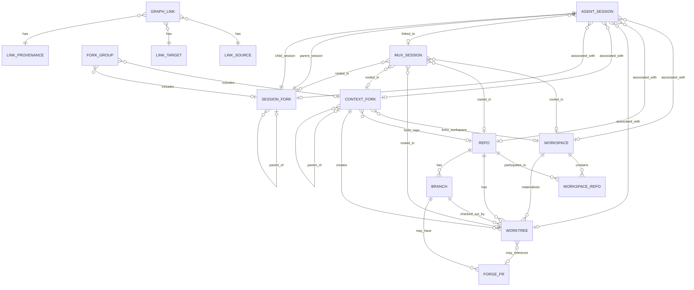

# Conspectus Design

Extract session discovery, mux status, fork/session attribution, and forge
association into a separate binary that complements atelier. The goal is to
reduce atelier's CLI surface area while preserving enough shared code to avoid
duplicating brittle harness and workspace discovery logic.

## Product Goal

Build an opinionated read-only-first status tool for the user's AI work graph.
It should show, in one integrated view:

- agent sessions across all supported AI CLI tools
- associated repos, worktrees, branches, and workspaces
- mux sessions linked to workspaces, worktrees, or agent sessions
- forge PRs linked to branches/worktrees
- fork lineage at both context and session level
- basic activity/status signals where each source can provide them

Unlike `atelier status`, this tool should discover sparse records. A row with
only an agent session is valid; so is a row with only a tmux session rooted in a
repo, or a worktree branch with an open PR and no known agent session.

## Relationship To Atelier

Atelier remains a workspace materializer and policy launcher:

- creates and manages one flavor of multi-repo workspace
- creates worktrees and fork metadata that conspectus can ingest
- owns `atelier.toml` and `.atelier/forks/index.toml`
- generates harness config and wrapper scripts
- launches harnesses through workspace policy

The new binary owns cross-workspace observability:

- global and workspace-local session discovery
- mux session discovery
- forge correlation
- sparse status tables and JSON output
- optional user-defined links between discovered entities

Code sharing should be formal but minimal. Prefer a shared internal library or
small common crates for pure discovery/parsing types. Avoid making the new tool
depend on atelier command modules directly. Leave room to extract the new tool
into a separate repository later.

Likely atelier features to move or delegate over time:

- `atelier session list`
- `atelier mux status`
- forge/PR status integration
- portions of `atelier status` that are really graph observability rather than
  workspace materialization health

## Initial Scope

Start read-only, but design the data model and storage layout for quick follow-up
commands that let users add or remove links manually.

Concrete v1 sources:

- harnesses: same support set as atelier for now (`claude-code`, `opencode`,
  `codex`, `aider`)
- mux: tmux as the first implementation
- forge: GitHub as the first implementation
- workspaces: generic workspaces and individual git repos/worktrees

Design abstractions for additional harnesses, mux backends, and forge providers,
but do not implement them until needed.

## Core Model

Represent the world as nodes and links.

Nodes:

- `AgentSession`
- `MuxSession`
- `Repo`
- `Worktree`
- `Branch`
- `Workspace`
- `ContextFork`
- `SessionFork`
- `ForkGroup`
- `ForgePr`

Links:

- agent session launched from cwd/worktree
- agent session belongs to workspace, context fork, or session fork
- mux session rooted at path
- mux session linked to agent session
- worktree belongs to repo and branch
- branch has forge PR
- context forks and session forks have parent/child lineage
- fork group records whether a fork operation created context, session, or both
- user-declared override or confirmation

Links should carry provenance:

- `discovered`: inferred from a path, transcript, branch, forge query, or mux
  metadata
- `convention`: inferred from naming/path conventions such as fork roots or
  workspace layout
- `declared`: explicitly configured by the user
- `cached`: remembered for performance and invalidated by freshness rules

Manual `declared` links should win over discovered links when they conflict.

## Entity Relationship Draft

This ERD is a pressure-test target, not final schema. It separates first-class
things the user reasons about from relationship records that carry provenance.



Entity notes:

- `Repo` is the durable git repository identity. A single repo can stand alone
  or participate in one or more workspaces over time.
- `Workspace` is a folder-level working context with one or more repo worktrees
  checked out. A workspace may be ephemeral, with no versioned metadata, or
  persistent, with versioned metadata describing its intended shape.
- `Workspace` contains repo memberships through `WorkspaceRepo`, not by owning
  repos outright.
- `WorkspaceRepo` is a membership edge because workspace membership may carry
  workspace-local identity, path, role, or checkout policy.
- `Worktree` is a concrete checkout path for a repo. It normally has exactly
  one current branch, but the branch can change as the checkout changes.
- `Branch` belongs to a repo and may have zero or more forge PRs. Multiple PRs
  are possible across forges, remotes, closed historical PRs, or ambiguous
  branch reuse.
- `ContextFork` records a fork of the working context: a repo, a workspace, or
  both. It creates one or more concrete worktrees and can have parent/child
  lineage independent of agent sessions.
- `SessionFork` records a fork of agent session state. It connects a parent
  agent session to a child agent session and can have parent/child lineage
  independent of repo or workspace changes.
- `ForkGroup` records a user-visible fork operation. It may include both a
  context fork and a session fork, only a context fork, or only a session fork.
  A group with neither is a noop and should not be represented.
- `AgentSession` is a harness-native session record. It may be global, orphaned,
  repo-rooted, worktree-rooted, workspace-rooted, context-fork-rooted, or
  session-fork-rooted.
- `MuxSession` is a terminal multiplexer session. It can be linked to an agent
  session and/or rooted in a workspace, repo, worktree, context fork, or session
  fork path.
- `ForgePr` is a forge pull request record. GitHub is the only v1 provider, but
  the entity should not encode GitHub-specific assumptions into the graph shape.
- `GraphLink` is the normalized edge record used in JSON output and durable
  declared state. It captures source, target, relation kind, provenance,
  confidence, freshness, and whether it is ignored or overridden.

Expected cardinality and sparsity:

- A repo can exist with no workspace; a workspace can contain many repos.
- A repo can have many worktrees; a worktree is for one repo.
- A workspace can materialize many worktrees; a worktree may be outside any
  workspace.
- A context fork can fork a repo, a workspace, or both. It normally creates one
  or more worktrees.
- A context fork can have zero or one parent context fork and many child context
  forks.
- A session fork connects one parent agent session to one child agent session.
  The child session may be active, inactive, or not yet discovered by a harness
  adapter.
- A session fork can have zero or one parent session fork and many child session
  forks.
- A fork group must include a context fork, a session fork, or both. A group
  with neither side is a noop and is not supported.
- An agent session can exist without any known repo, worktree, workspace, mux
  session, or PR.
- A mux session can exist without any known agent session.
- An agent session should have at most one active mux link by default, but the
  graph should preserve conflicting candidates for diagnostics.
- A mux session may contain multiple agent sessions in practice. The default
  `agent` projection still renders one row per agent session.
- A branch can have zero, one, or many PR records. The table view should prefer
  open PRs and report ambiguity rather than collapsing it silently.

Fork type matrix:

| Context Fork | Session Fork | Meaning |
| --- | --- | --- |
| yes | yes | Heavyweight fork; probably the default for agent work. Creates isolated working context and isolated session lineage. |
| yes | no | Context-only fork. Useful for pure git workflows, branch/worktree experiments, or pre-staging work for a later agent. |
| no | yes | Session-only fork. Useful for parallel non-colliding work, read-only agents, or multiple agents sharing one context. |
| no | no | Noop. Do not support or persist this as a graph node. |

Lifecycle transitions:

- Single repo to workspace: grouping one or more repo worktrees under a common
  folder creates a `Workspace` plus `WorkspaceRepo` membership. Existing
  repo-local links remain valid and can be shadowed by workspace-local links
  when more specific.
- Workspace to standalone repo: removing or ignoring a workspace should not
  delete repo, worktree, branch, agent session, mux session, or PR nodes. The
  graph should degrade to repo/worktree associations.
- Context fork: forking a repo or workspace creates a `ContextFork` and one or
  more worktrees. Existing sessions rooted in those paths may gain a
  context-fork association on the next discovery pass.
- Session fork: forking an agent session creates a `SessionFork` linking the
  parent and child agent sessions. It may reuse the same worktree when no
  context fork was requested.
- Context plus session fork: the default heavyweight fork creates both a
  `ContextFork` and a `SessionFork`, grouped by one `ForkGroup`.
- Context fork without session fork: supported for pure git workflows, even
  though it may not be useful for agent activity by itself.
- Session fork without context fork: supported for parallel work that will not
  collide, read-only agents, or multi-agent setups where separate session state
  is useful without a new checkout.
- Fork group with no context fork and no session fork: noop; do not create a
  graph node.
- Fork back to ordinary worktree: if fork metadata disappears but the worktree
  remains, sessions should keep their worktree/repo links and lose only the
  context-fork lineage unless a declared link preserves it.
- Orphan session to rooted session: when a later discovery pass finds cwd,
  transcript, mux, or declared metadata, the same `AgentSession` can gain links
  to repo/worktree/workspace/context-fork/session-fork nodes without changing
  session identity.
- Discovered link to declared link: user confirmation or override should create
  a durable `GraphLink` with `declared` provenance, leaving the discovered link
  visible in detailed diagnostics.

## Discovery Strategy

Default discovery should be useful without scanning the user's entire home tree.
The sane default is:

- read home-global agent-specific state/config directories for supported
  harnesses
- read mux sessions from the configured mux backend
- inspect cwd and explicitly configured scan roots
- read known workspace metadata from supported providers when a workspace is
  discovered
- inspect git metadata for discovered repos/worktrees
- query GitHub for PRs associated with discovered repo/branch pairs

Additive discovery:

- allow users to opt in workspace/repo roots manually
- support autodiscovery from known workspace locations or config files
- support a future "bootstrap" mode that recursively scans selected roots,
  including `$HOME` only when explicitly requested

Avoid default behavior that recursively walks all of `$HOME`.

## State And Persistence

Track the minimum necessary state to tie entities together.

Project/workspace-local state is preferred for durable relationships:

- user-declared links for sessions rooted in a workspace should live as close to
  that workspace/project as possible
- mappings should be suitable for version control when the workspace state is
  versioned
- this preserves the future path toward portable, version-controlled agent
  sessions and persistent cross-machine session IDs

Global state is acceptable for:

- global/orphan sessions that do not belong to a workspace
- user-wide scan roots and ignore rules
- performance caches
- cached forge metadata
- last-seen indexes

Hybrid rule of thumb:

- if an entity is rooted under a workspace or a git repo with a local
  metadata area, store durable declared links locally
- if an entity is home-global or cannot be tied to a project, store declared
  links globally
- caches may be global even when durable declarations are local, as long as
  cache rebuilds do not lose user intent

Local and global state locations:

- persistent workspace: `.conspectus.toml`
- standalone repo: `.conspectus.toml`
- provider-specific workspace metadata may point at an alternate local state
  file when that provider owns a private metadata directory
- global config: `$XDG_CONFIG_HOME/conspectus/config.toml`
- global cache/index: `$XDG_DATA_HOME/conspectus/`

Local declared-link files should be created only on demand, when the first
manual link/ignore/override command needs to persist user intent. Read-only
discovery should not dirty a repo or workspace.

Durable declared state should use TOML for the first implementation. The files
need to be reviewable, hand-editable, and reasonable to version-control. A
future SQLite or line-oriented store is acceptable for caches and indexes, but
should not become the only representation of user-authored relationships unless
there is a clear migration story back to portable project-local state.

Do not make session portability part of this refactor, but avoid storage choices
that would make portable session IDs or version-controlled session state harder.

## Manual Link Commands

Post-v1 commands should let users define relationships that discovery cannot
infer:

- link/unlink mux session to agent session
- link/unlink GitHub PR to worktree or branch
- link/unlink agent session to workspace, repo, worktree, context fork, or
  session fork
- mark session/repo/mux rows ignored
- confirm or override a discovered relationship

These commands should write declared links to the nearest appropriate local or
global store according to the persistence rules above.

## Status Views

The default `conspectus session` table should be AgentSession-oriented: one row
per discovered agent session, with mux information shown as a sparse joined
column when a mux session can be linked. This avoids pretending agent sessions
and mux sessions are the same kind of thing.

The session view should support configurable projections:

- `agent`: default; one row per agent session, with linked mux data in sparse
  columns
- `mux`: one row per mux session, with linked agent data in sparse columns
- `union`: rows for both node types, with a `tool` / `kind` column

Use `session.projection` as the configuration key in TOML:

```toml
[session]
projection = "agent" # "agent", "mux", or "union"
```

Future TODO: if no agent sessions are auto-discovered but mux sessions are
available, consider falling back to the MuxSession-oriented view for that run,
with an explicit note.

Candidate columns for the default AgentSession-oriented table:

- agent/tool
- session id
- activity/status
- mux session
- repo/worktree
- branch
- workspace
- context fork
- session fork
- lineage
- PR
- last activity
- provenance/confidence

JSON output should preserve the graph shape directly: nodes, links, provenance,
and source metadata. The table can be a projection over that graph.

Declared relationships should be authoritative but not destructive:

- local declared links win over global declared links
- declared links win over discovered links
- fresh discovered links win over cached links
- conflicts are displayed as status, not treated as fatal errors
- detailed output should show all candidate links and their provenance

Fork-aware views should:

- read fork metadata from supported providers when available
- show context fork lineage and session fork lineage separately
- show fork groups when a single user action created both sides
- associate sessions rooted in context-fork paths or session-fork state
- associate mux sessions rooted under context-fork paths
- fall back to path/branch/session conventions when provider metadata is
  unavailable

## Migration Plan

1. Identify and isolate pure discovery/parsing code in atelier:
   - harness session discovery
   - mux session discovery
   - workspace/fork metadata readers
   - git repo/worktree/branch probes
   - GitHub PR association
2. Move reusable pieces behind library interfaces that do not depend on atelier
   command modules.
3. Add the standalone binary with read-only graph collection and JSON output.
4. Add table rendering for sparse rows and fork lineage.
5. Add local/global link stores plus manual link/unlink commands.
6. Have atelier delegate or deprecate overlapping commands:
   - `atelier session list`
   - `atelier mux status`
   - forge-related status surfaces
   - graph-heavy parts of `atelier status`
7. Reassess whether the standalone binary should stay in this repository or be
   extracted once the shared library boundary stabilizes.

## Decisions

- Name: `conspectus`.
- Local state files:
  - persistent workspace: `.conspectus.toml`
  - standalone repo: `.conspectus.toml`
  - provider-specific workspace metadata may redirect to a provider-owned local
    state path
- Global paths:
  - config: `$XDG_CONFIG_HOME/conspectus/config.toml`
  - cache/index: `$XDG_DATA_HOME/conspectus/`
- Local declared-link files are write-on-demand only.
- Declared links win over discovered links; conflicts are displayed, not fatal.
- Durable declared state should be TOML; cache/index internals may use another
  storage format later.
- Default `conspectus session` view is AgentSession-oriented with MuxSession as
  a sparse joined column.
- Alternate session projections should be configurable as `agent`, `mux`, and
  `union`.
- The config key for selecting a session projection is `session.projection`.
- Bootstrap scans should print suggested roots and links by default. Persisting
  them to global config should require an explicit write flag.

## Deferred Design Questions

- What should the explicit bootstrap write flag be called?
- What cache/index format is needed after the read-only graph collector exists?
- Should the no-agent-session fallback to `mux` projection be automatic,
  configurable, or only suggested in the output?
