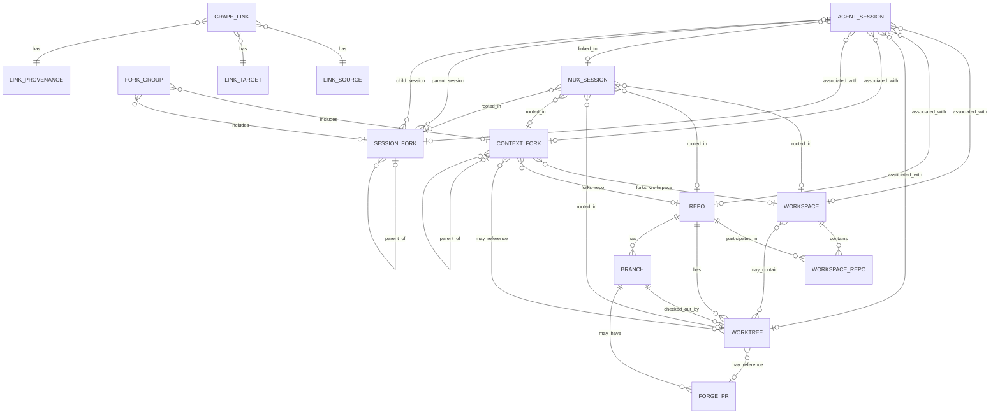

# Conspectus Design

Extract session discovery, mux status, fork/session attribution, and forge
association into a separate binary that complements atelier. The goal is to
reduce atelier's CLI surface area while preserving enough shared code to avoid
duplicating brittle harness and workspace discovery logic.

## Product Goal

Build an opinionated read-only-first status tool for the user's AI work graph.
It should show, in one integrated view:

- agent sessions across all supported AI CLI tools
- associated repos, worktrees, branches, and workspaces
- mux sessions linked to workspaces, worktrees, or agent sessions
- forge PRs linked to branches/worktrees
- fork lineage at both context and session level
- basic activity/status signals where each source can provide them

Unlike `atelier status`, this tool should discover sparse records. A row with
only an agent session is valid; so is a row with only a tmux session rooted in a
repo, or a worktree branch with an open PR and no known agent session.

## Design Requirements

- Conspectus is focused on capturing links among ephemeral entities such as
  agent sessions and forks, lifecycled entities such as PRs, and long-lived
  entities such as repositories. It builds those links into a graph that helps
  users navigate the explicit and implicit project structure that emerges from
  using one or more agent harnesses.
- Design data-model-first. The core graph should be stable enough to serve as
  the foundation for the project as it matures. New features and behavioral
  changes should be assessed against the data model first, with implementation
  flowing outward from there.
- Provider-specific reality is allowed at the edges, but the graph shape stays
  provider-neutral. V1 can know about concrete providers such as Atelier, tmux,
  GitHub, and specific agent harnesses without making their private schemas the
  public graph model.
- Conspectus was seeded from the atelier repository, but it is not beholden to
  Atelier's data model. Atelier metadata is an important input source, not the
  shape the Conspectus graph must copy.
- Consumers of the Conspectus graph, including Conspectus's own tabular views,
  must assume the graph is inherently sparse. Many projects will form separate
  cliques, and many useful links will be missing because they cannot be
  auto-discovered.
- Derive as many links as possible from on-disk state and common workflow
  conventions. Conspectus should recognize common workflows without requiring
  users to scatter override files across every repo and workspace.
- Allow global and local overrides to establish, confirm, ignore, or replace
  links, but make overrides rare by improving discovery and convention support.
  User-authored link state should be federated near the repo or workspace when
  the relationship is project-rooted.
- Keep performance caches and other rebuildable indexes outside any given repo
  or workspace. Caches may accelerate discovery, but they must not become the
  only durable representation of user intent.
- Use a loose definition of `Workspace`: a folder where one or more git repos,
  symlinks to repos, or worktrees from repos are present together with the
  intent to make coordinated changes among them. Conspectus may assume
  conventions such as matching branch names when those conventions produce sane
  defaults for workspace-oriented views.
- Conspectus does not own workspace contents beyond the links it tracks. It can
  read workspace metadata, derive relationships from layout, and write explicit
  Conspectus link state on demand, but it should not become a workspace
  materializer.
- Use a loose definition of `Fork`, or multiple fork terms if needed, centered
  on tracking provenance of agent sessions, git branches, worktrees, and related
  state. The model should support context lineage and session lineage without
  assuming every provider implements both in the same way.
- The initial interface is a CLI with two primary purposes: present tabular
  views of the graph built from derived or specified links, and provide commands
  for users to create, read, update, and delete those links.
- Conspectus should expose a machine-readable graph for other tools to consume.
  Future consumers may include interactive TUIs that manage agent sessions,
  connect to mux sessions, or provide workflows similar to agent-deck.

## Relationship To Atelier

Atelier remains a workspace materializer and policy launcher:

- creates and manages one flavor of multi-repo workspace
- creates worktrees and fork metadata that conspectus can ingest
- owns `atelier.toml` and `.atelier/forks/index.toml`
- generates harness config and wrapper scripts
- launches harnesses through workspace policy

The new binary owns cross-workspace observability:

- global and workspace-local session discovery
- mux session discovery
- forge correlation
- sparse status tables and JSON output
- optional user-defined links between discovered entities

Code sharing should be formal but minimal. Prefer a shared internal library or
small common crates for pure discovery/parsing types. Avoid making the new tool
depend on atelier command modules directly. Leave room to extract the new tool
into a separate repository later.

Likely atelier features to move or delegate over time:

- `atelier session list`
- `atelier mux status`
- forge/PR status integration
- portions of `atelier status` that are really graph observability rather than
  workspace materialization health

## Initial Scope

Start read-only, but design the data model and storage layout for quick follow-up
commands that let users add or remove links manually.

Concrete v1 sources:

- harnesses: same support set as atelier for now (`claude-code`, `opencode`,
  `codex`, `aider`)
- mux: tmux as the first implementation
- forge: GitHub as the first implementation
- workspaces: loose workspace groupings and individual git repos/worktrees

Design abstractions for additional harnesses, mux backends, and forge providers,
but do not implement them until needed.

## Core Model

Represent the world as nodes and links.

Nodes:

- `AgentSession`
- `MuxSession`
- `Repo`
- `Worktree`
- `Branch`
- `Workspace`
- `ContextFork`
- `SessionFork`
- `ForkGroup`
- `ForgePr`

Links:

- agent session launched from cwd/worktree
- agent session belongs to workspace, context fork, or session fork
- mux session rooted at path
- mux session linked to agent session
- worktree belongs to repo and branch
- branch has forge PR
- context forks and session forks have parent/child lineage
- fork group records whether a fork-like operation affected context, session,
  or both
- user-declared override or confirmation

Links should carry provenance:

- `discovered`: inferred from a path, transcript, branch, forge query, or mux
  metadata
- `convention`: inferred from naming/path conventions such as fork roots or
  workspace layout
- `declared`: explicitly configured by the user
- `cached`: remembered for performance and invalidated by freshness rules

Manual `declared` links should win over discovered links when they conflict.

## Entity Relationship Draft

This ERD is a pressure-test target, not final schema. It separates first-class
things the user reasons about from relationship records that carry provenance.



Entity notes:

- `Repo` is the durable git repository identity. A single repo can stand alone
  or participate in one or more workspaces over time.
- `Workspace` is a folder-level working context where one or more git repos,
  symlinks to repos, or worktrees from repos are present together with the
  intent to make coordinated changes among them. A workspace may be inferred
  from layout/convention, ephemeral with no versioned metadata, or persistent
  with metadata describing its intended shape.
- `Workspace` contains repo memberships through `WorkspaceRepo`, not by owning
  repos outright.
- `WorkspaceRepo` is a membership edge because workspace membership may carry
  workspace-local identity, path, role, checkout policy, or whether the member
  is a concrete checkout, symlink, or convention-derived participant.
- `Worktree` is a concrete checkout path for a repo. It normally has exactly
  one current branch, but the branch can change as the checkout changes.
- `Branch` belongs to a repo and may have zero or more forge PRs. Multiple PRs
  are possible across forges, remotes, closed historical PRs, or ambiguous
  branch reuse.
- `ContextFork` records provenance for a fork-like change to the working
  context: a repo, a workspace, or both. It may create concrete worktrees,
  reference existing worktrees, or exist only as provider metadata, and it can
  have parent/child lineage independent of agent sessions.
- `SessionFork` records a fork of agent session state. It connects a parent
  agent session to a child agent session and can have parent/child lineage
  independent of repo or workspace changes.
- `ForkGroup` records a user-visible fork-like operation when a provider exposes
  one. It may include both context lineage and session lineage, only context
  lineage, or only session lineage. A group with neither is a noop and should
  not be represented.
- `AgentSession` is a harness-native session record. It may be global, orphaned,
  repo-rooted, worktree-rooted, workspace-rooted, context-fork-rooted, or
  session-fork-rooted.
- `MuxSession` is a terminal multiplexer session. It can be linked to an agent
  session and/or rooted in a workspace, repo, worktree, context fork, or session
  fork path.
- `ForgePr` is a forge pull request record. GitHub is the only v1 provider, but
  the entity should not encode GitHub-specific assumptions into the graph shape.
- `GraphLink` is the normalized edge record used in JSON output and durable
  declared state. It captures source, target, relation kind, provenance,
  confidence, freshness, and whether it is ignored or overridden.

Expected cardinality and sparsity:

- A repo can exist with no workspace; a workspace can contain many repos.
- A repo can have many worktrees; a worktree is for one repo.
- A workspace can contain many repo participants, including worktrees, ordinary
  repos, symlinks, or convention-derived members. A worktree may be outside any
  workspace.
- A context fork can fork a repo, a workspace, or both. It may create concrete
  worktrees, reference existing worktrees, or be represented only by provider
  metadata.
- A context fork can have zero or one parent context fork and many child context
  forks.
- A session fork connects one parent agent session to one child agent session.
  The child session may be active, inactive, or not yet discovered by a harness
  adapter.
- A session fork can have zero or one parent session fork and many child session
  forks.
- A fork group must include a context fork, a session fork, or both. A group
  with neither side is a noop and is not supported.
- An agent session can exist without any known repo, worktree, workspace, mux
  session, or PR.
- A mux session can exist without any known agent session.
- An agent session should have at most one active mux link by default, but the
  graph should preserve conflicting candidates for diagnostics.
- A mux session may contain multiple agent sessions in practice. The default
  `agent` projection still renders one row per agent session.
- A branch can have zero, one, or many PR records. The table view should prefer
  open PRs and report ambiguity rather than collapsing it silently.

Fork type matrix:

| Context Fork | Session Fork | Meaning |
| --- | --- | --- |
| yes | yes | Heavyweight fork; probably the default for agent work. Records context lineage and isolated session lineage, and may create isolated worktrees. |
| yes | no | Context-only fork. Useful for pure git workflows, branch/worktree experiments, or pre-staging work for a later agent. |
| no | yes | Session-only fork. Useful for parallel non-colliding work, read-only agents, or multiple agents sharing one context. |
| no | no | Noop. Do not support or persist this as a graph node. |

Lifecycle transitions:

- Single repo to workspace: grouping one or more repos, symlinks, or worktrees
  under a common folder creates a `Workspace` plus `WorkspaceRepo` membership.
  Existing repo-local links remain valid and can be shadowed by workspace-local
  links when more specific.
- Workspace to standalone repo: removing or ignoring a workspace should not
  delete repo, worktree, branch, agent session, mux session, or PR nodes. The
  graph should degrade to repo/worktree associations.
- Context fork: forking a repo or workspace creates a `ContextFork` and may
  create worktrees, reference existing worktrees, or record only provider
  metadata. Existing sessions rooted in those paths may gain a context-fork
  association on the next discovery pass.
- Session fork: forking an agent session creates a `SessionFork` linking the
  parent and child agent sessions. It may reuse the same worktree when no
  context fork was requested.
- Context plus session fork: a heavyweight fork creates both context lineage and
  session lineage, grouped by one `ForkGroup` when the provider exposes a
  single operation that created both.
- Context fork without session fork: supported for pure git workflows, even
  though it may not be useful for agent activity by itself.
- Session fork without context fork: supported for parallel work that will not
  collide, read-only agents, or multi-agent setups where separate session state
  is useful without a new checkout.
- Fork group with no context fork and no session fork: noop; do not create a
  graph node.
- Fork back to ordinary worktree: if fork metadata disappears but the worktree
  remains, sessions should keep their worktree/repo links and lose only the
  context-fork lineage unless a declared link preserves it.
- Orphan session to rooted session: when a later discovery pass finds cwd,
  transcript, mux, or declared metadata, the same `AgentSession` can gain links
  to repo/worktree/workspace/context-fork/session-fork nodes without changing
  session identity.
- Discovered link to declared link: user confirmation or override should create
  a durable `GraphLink` with `declared` provenance, leaving the discovered link
  visible in detailed diagnostics.

## Discovery Strategy

Default discovery should be useful without scanning the user's entire home tree.
The sane default is:

- read home-global agent-specific state/config directories for supported
  harnesses
- read mux sessions from the configured mux backend
- inspect cwd and explicitly configured scan roots
- read known workspace metadata from supported providers when a workspace is
  discovered
- inspect git metadata for discovered repos/worktrees
- query GitHub for PRs associated with discovered repo/branch pairs

Discovery should prefer direct on-disk evidence first, then provider metadata,
then common conventions, then user-declared overrides. Conventions such as
matching branch names or known fork roots should create useful candidate links,
but they should carry provenance and confidence rather than silently becoming
facts.

Additive discovery:

- allow users to opt in workspace/repo roots manually
- support autodiscovery from known workspace locations or config files
- support a future "bootstrap" mode that recursively scans selected roots,
  including `$HOME` only when explicitly requested

Avoid default behavior that recursively walks all of `$HOME`.

## State And Persistence

Track the minimum necessary state to tie entities together. Persist user intent;
derive everything else from on-disk state, provider metadata, conventions, or
rebuildable caches whenever possible.

Project/workspace-local state is preferred for durable relationships:

- user-declared links for sessions rooted in a workspace should live as close to
  that workspace/project as possible
- mappings should be suitable for version control when the workspace state is
  versioned
- this preserves the future path toward portable, version-controlled agent
  sessions and persistent cross-machine session IDs

Global state is acceptable for:

- global/orphan sessions that do not belong to a workspace
- user-wide scan roots and ignore rules
- performance caches
- cached forge metadata
- last-seen indexes

Hybrid rule of thumb:

- if an entity is rooted under a workspace or a git repo with a local
  metadata area, store durable declared links locally
- if an entity is home-global or cannot be tied to a project, store declared
  links globally
- caches and rebuildable indexes should be global even when durable
  declarations are local, so cache rebuilds do not dirty project trees or lose
  user intent

Local and global state locations:

- persistent workspace: `.conspectus.toml`
- standalone repo: `.conspectus.toml`
- provider-specific workspace metadata may point at an alternate local state
  file when that provider owns a private metadata directory
- global config: `$XDG_CONFIG_HOME/conspectus/config.toml`
- global cache/index: `$XDG_DATA_HOME/conspectus/`

Local declared-link files should be created only on demand, when the first
manual link/ignore/override command needs to persist user intent. Read-only
discovery should not dirty a repo or workspace.

Durable declared state should use TOML for the first implementation. The files
need to be reviewable, hand-editable, and reasonable to version-control. A
future SQLite or line-oriented store is acceptable for caches and indexes, but
should not become the only representation of user-authored relationships unless
there is a clear migration story back to portable project-local state.

Do not make session portability part of this refactor, but avoid storage choices
that would make portable session IDs or version-controlled session state harder.

## Manual Link Commands

Post-v1 commands should let users create, read, update, and delete
relationships that discovery cannot infer:

- link/unlink mux session to agent session
- link/unlink GitHub PR to worktree or branch
- link/unlink agent session to workspace, repo, worktree, context fork, or
  session fork
- mark session/repo/mux rows ignored
- confirm or override a discovered relationship

These commands should write declared links to the nearest appropriate local or
global store according to the persistence rules above.

## Status Views

The default `conspectus session` table should be AgentSession-oriented: one row
per discovered agent session, with mux information shown as a sparse joined
column when a mux session can be linked. This avoids pretending agent sessions
and mux sessions are the same kind of thing.

The session view should support configurable projections:

- `agent`: default; one row per agent session, with linked mux data in sparse
  columns
- `mux`: one row per mux session, with linked agent data in sparse columns
- `union`: rows for both node types, with a `tool` / `kind` column

Use `session.projection` as the configuration key in TOML:

```toml
[session]
projection = "agent" # "agent", "mux", or "union"
```

Future TODO: if no agent sessions are auto-discovered but mux sessions are
available, consider falling back to the MuxSession-oriented view for that run,
with an explicit note.

Candidate columns for the default AgentSession-oriented table:

- agent/tool
- session id
- activity/status
- mux session
- repo/worktree
- branch
- workspace
- context fork
- session fork
- lineage
- PR
- last activity
- provenance/confidence

Machine-readable output should preserve the graph shape directly: nodes, links,
provenance, and source metadata. The table can be a projection over that graph.
The first implementation can expose this as JSON, but the interface should be
treated as a graph API for future tools rather than a table serialization.

Declared relationships should be authoritative but not destructive:

- local declared links win over global declared links
- declared links win over discovered links
- fresh discovered links win over cached links
- conflicts are displayed as status, not treated as fatal errors
- detailed output should show all candidate links and their provenance

Fork-aware views should:

- read fork metadata from supported providers when available
- show context fork lineage and session fork lineage separately
- show fork groups when a single user action created both sides
- associate sessions rooted in context-fork paths or session-fork state
- associate mux sessions rooted under context-fork paths
- fall back to path/branch/session conventions when provider metadata is
  unavailable

## Migration Plan

1. Identify and isolate pure discovery/parsing code in atelier:
   - harness session discovery
   - mux session discovery
   - workspace/fork metadata readers
   - git repo/worktree/branch probes
   - GitHub PR association
2. Move reusable pieces behind library interfaces that do not depend on atelier
   command modules.
3. Add the standalone binary with read-only graph collection and JSON output.
4. Add table rendering for sparse rows and fork lineage.
5. Add local/global link stores plus manual link/unlink commands.
6. Have atelier delegate or deprecate overlapping commands:
   - `atelier session list`
   - `atelier mux status`
   - forge-related status surfaces
   - graph-heavy parts of `atelier status`
7. Reassess whether the standalone binary should stay in this repository or be
   extracted once the shared library boundary stabilizes.

## Decisions

- Name: `conspectus`.
- Local state files:
  - persistent workspace: `.conspectus.toml`
  - standalone repo: `.conspectus.toml`
  - provider-specific workspace metadata may redirect to a provider-owned local
    state path
- Global paths:
  - config: `$XDG_CONFIG_HOME/conspectus/config.toml`
  - cache/index: `$XDG_DATA_HOME/conspectus/`
- Local declared-link files are write-on-demand only.
- Declared links win over discovered links; conflicts are displayed, not fatal.
- Durable declared state should be TOML; cache/index internals may use another
  storage format later.
- Default `conspectus session` view is AgentSession-oriented with MuxSession as
  a sparse joined column.
- Alternate session projections should be configurable as `agent`, `mux`, and
  `union`.
- The config key for selecting a session projection is `session.projection`.
- Bootstrap scans should print suggested roots and links by default. Persisting
  them to global config should require an explicit write flag.

## Open Design Questions

These questions should be worked through incrementally before locking the
phased implementation plan. They are intentionally phrased as unresolved design
pressure points rather than decisions.

### Likely Answered By Design Requirements

- Whether Conspectus should copy Atelier's model is answered: no. Atelier is an
  input provider and migration source, but the Conspectus graph should be
  provider-neutral and may diverge where the data model calls for it.
- Whether provider-specific details belong in the graph is constrained:
  provider-specific reality belongs at the edges as source metadata or adapter
  behavior, while the core graph remains provider-neutral.
- Whether graph consumers can expect dense, fully linked rows is answered: no.
  Sparse cliques and missing links are intrinsic to the product and must be
  handled by all projections and downstream tools.
- Whether users should be expected to maintain many override files is answered:
  no. Conspectus should derive links from on-disk state and conventions first,
  using overrides as a rare escape hatch.
- Whether performance caches can live inside repos or workspaces is answered:
  no for rebuildable state. Caches and indexes should live globally; durable
  user-authored link intent should be federated near the project when rooted
  there.
- Whether `Workspace` should mean only an Atelier workspace is answered: no. A
  workspace is a loose coordinated working context that may be inferred from
  repos, symlinks, worktrees, metadata, and conventions.
- Whether Conspectus should own workspace contents is answered: no. It tracks
  links and may write Conspectus link state on demand, but it should not become
  a materializer.
- Whether `ContextFork creates Worktree` is sufficient is answered: no. Context
  lineage must distinguish created worktrees, referenced worktrees, and
  metadata-only fork roots.
- Whether Atelier-specific fork fields should become core graph shape is
  constrained: they should be preserved as provider/source metadata unless the
  data model identifies a provider-neutral concept.
- Whether the first interface is only human-readable tables is answered: no.
  The CLI should provide tabular views and link CRUD, while machine-readable
  graph output is a primary interface for other tools.

### Node Identity And Stable IDs

- What is the stable identity for each node type? In particular, should `Repo`
  identity come from canonical path, git common-dir, remote URL, or a derived
  fingerprint?
- Is `Worktree` identity path-based, git metadata-based, or both? How should
  moved worktrees be recognized?
- How should `Workspace` identity survive path moves, copied directories, and
  ephemeral workspaces with no versioned metadata?
- Are harness-native session IDs globally unique, or should `AgentSession`
  identity always include harness key, state root, and source path?

### GraphLink Versus Typed Relationships

- Are concrete ERD relationships such as `WORKTREE -> BRANCH` and
  `BRANCH -> FORGE_PR` stored as typed relationship records, represented only as
  `GraphLink`, or maintained as both typed structs and normalized graph links?
- If both typed relationships and `GraphLink` exist, which one is authoritative
  for JSON output, conflict reporting, declared overrides, and table
  projections?
- Should `GraphLink` represent every discovered relationship, or only durable
  declared links plus diagnostics for conflicts?

### Atelier Fork Metadata Mapping

- How exactly does one Atelier `.atelier/forks/index.toml` `ForkEntry` map into
  Conspectus `ContextFork`, `SessionFork`, and `ForkGroup` nodes?
- Does one Atelier fork entry become one `ForkGroup`, or can a single fork entry
  produce multiple fork groups when it contains multiple harness session rows?
- How should Atelier's per-repo fork membership states (`forked`, `link`, or
  neither for research mode) map into context-fork relationships?
- Which Atelier-specific fork fields, if any, should be promoted into
  provider-neutral graph concepts rather than preserved only as source metadata?

### Context Fork Edge Cases

- How should research forks be represented when they create a fork root and
  metadata but no worktrees or branches?
- How should selected forks represent symlinked reference repos where edits
  affect the parent worktree rather than an isolated fork worktree?
- What relation kinds or attributes should distinguish created worktrees,
  referenced parent worktrees, and metadata-only context roots?
- Can a context fork exist for a single standalone repo without an enclosing
  workspace, and if so how is that different from an ordinary worktree branch?

### Session Fork Cardinality And Unresolved Endpoints

- Can `SessionFork` exist when the parent session is unknown, intentionally
  absent, or represented only by a harness-native ID?
- Can `SessionFork` exist before the child `AgentSession` has been discovered on
  disk?
- How should degraded or approximate harness behavior be represented, such as
  copied transcript history, unsupported native forking, or fresh-session
  starts?
- Should unresolved parent or child endpoints be placeholder `AgentSession`
  nodes, nullable fields on `SessionFork`, or provider metadata attached to a
  fork-group record?

### ForkGroup Granularity

- Is `ForkGroup` a user-visible operation, an Atelier fork entry, a
  context/session pair, or a grouping of all context and harness session effects
  created under one fork name?
- Can a `ForkGroup` contain one context fork and multiple session forks for
  different harnesses?
- Should context-only and session-only operations always create a `ForkGroup`,
  or only when the source provider exposes an operation-level grouping?

### Session And Mux Link Candidates

- Should ERD cardinalities for agent-session-to-mux and mux-to-agent links be
  many-candidate relationships, with a projection rule selecting the default
  display link?
- What makes one mux link "active" or preferred when multiple candidates exist:
  attachment state, cwd match, naming convention, declared link, or recency?
- How should a mux session containing multiple agent sessions render in the
  default agent projection and in the mux projection?

### Workspace Detection And Identity

- What concrete evidence threshold should make Conspectus infer a `Workspace`
  instead of merely a repo parent directory or scan root?
- How should nested workspaces, nested git repos, and workspaces containing
  symlinked repos be handled?
- How should generic workspace discovery interact with provider-specific
  metadata such as `atelier.toml` and `.atelier/forks/index.toml`?
- If multiple workspace providers claim the same path, which provider supplies
  identity, membership, and local state location?

### Forge PR Identity And Branch Association

- What provider-neutral fields define `ForgePr` identity while still preserving
  GitHub-specific data such as owner, repo, number, head repo, head branch, base
  repo, and state?
- Is a branch-to-PR association keyed by branch name, local branch plus remote,
  upstream tracking branch, forge head ref, or a combination?
- How should the graph represent multiple PRs for one branch across remotes,
  closed historical PRs, branch reuse, and forked head repositories?

### Declared-Link Conflict Semantics

- What exactly does an override suppress: a single candidate link, all links of
  a relation kind for a source node, or all discovered links between two nodes?
- Is "ignored" a node-level flag, a link-level flag, or both?
- How are local declared links, global declared links, discovered links, and
  cached links merged when they disagree?
- Should confirmation of a discovered link create a durable declared link that
  remains valid even if the original discovered evidence disappears?

## Deferred Design Questions

- What should the explicit bootstrap write flag be called?
- What cache/index format is needed after the read-only graph collector exists?
- Should the no-agent-session fallback to `mux` projection be automatic,
  configurable, or only suggested in the output?
