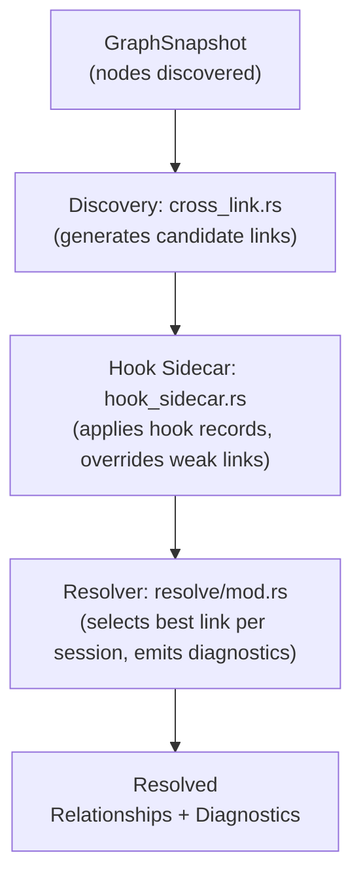
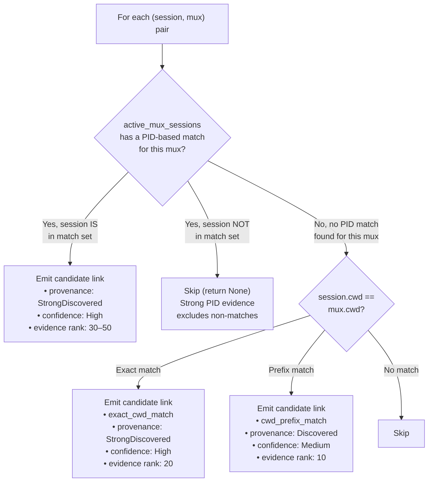
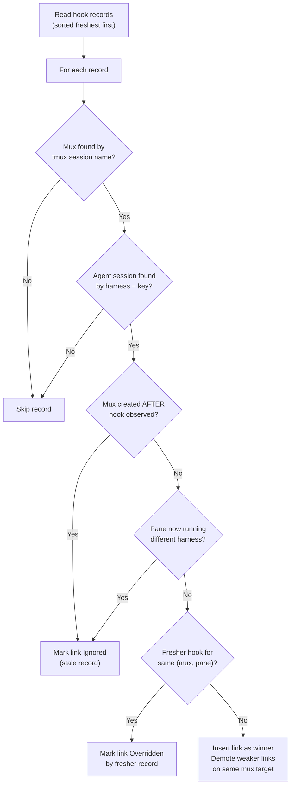
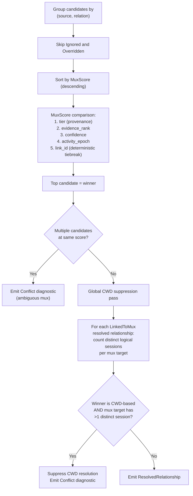

# Mux-Session Link Resolution

How Conspectus determines which tmux/mux session an agent session is running in.

---

## Pipeline Overview

---

## Phase 1 — Candidate Link Generation

`src/discovery/cross_link.rs` — `infer_with_fd_reader()`

For every `(agent_session, mux_session)` pair where both have a `cwd`:

### PID-based match evidence sources

| Evidence Source | How It Works | Link Evidence | Rank |
|---|---|---|---|
| procfs `/proc/{pid}/fd/` | Scans open file descriptors for session keys | `active_pane_fd_session_match` | 50 |
| procfs ∩ command argv | Intersection of fd + command session keys | `active_pane_fd_command_session_match` | 45 |
| Harness state files | Checks most recently written session file | `session_file_activity_match` | 40 |
| Process argv | Extracts session key from start command (e.g. `claude --resume <id>`) | `active_pane_command_session_match` | 30 |

The PID matcher also considers **lineage**: if the parent of a session is matched, the child session is included (covers `/resume` and fork scenarios).

### Design rule: no CWD filtering at discovery

CWD matching fires for **all** harnesses at the discovery layer — a mux session running `opencode` at `/work` will emit `exact_cwd_match` candidates to every agent session (codex, claude-code, opencode, etc.) sharing that directory. Discovery is intentionally indiscriminate; ambiguity is resolved at Phase 3 rather than suppressed prematurely.

---

## Phase 2 — Hook Sidecar

`src/discovery/hook_sidecar.rs` — `apply_hook_sidecars()`

Harness hooks send observations to the daemon when available. If no daemon snapshot is ready, they write a compact latest-only `hooks-latest.json` spool. This post-merge pass reads the daemonless spool and adjusts candidate links:

### Links overridden by hook sidecar

Hook sidecar records override these candidate link types on the same mux target:

- `active_pane_command_session_match`
- `exact_cwd_match`
- `cwd_prefix_match`

Stronger evidence (`active_pane_fd_session_match`, `hook_session_match`, `control_plane_current_session_match`) survives untouched.

---

## Phase 3 — Resolution

`src/resolve/mod.rs` — `resolve_links()`

Candidates are grouped by `(source, relation)`. For each group, the resolver picks one winner. Then a global suppression pass removes CWD-based resolutions that are ambiguous.

### CWD ambiguity suppression

CWD matching is indiscriminate at the discovery layer — a mux at `/work` gets linked to every session ever run from `/work`. The resolver corrects this by suppressing CWD-based resolutions when the mux target is claimed by **more than one distinct logical session** (identified by `harness_key` + `session_key`, collapsing across `state_scope` variations).

This means CWD resolution passes through only in the one-to-one case:

| Scenario | CWD winner? |
|---|---|
| One session has a CWD link to one mux | Passes |
| Two sessions have CWD links to the same mux | Suppressed for both |
| Session A has CWD to mux X, session B has FD match to mux X | CWD suppressed; FD match kept |
| Two sessions have CWD links to different muxes | Both pass |
| Declared link + CWD link to same mux, same logical session | CWD not suppressed (counts as one session) |

### MuxScore ordering

| Priority | Field | Values |
|---|---|---|
| 1 (highest) | **tier** (provenance) | `LocalDeclared(5)` > `GlobalDeclared(4)` > `StrongDiscovered(3)` > `Discovered(2)` > `Convention(1)` > `Cached(0)` |
| 2 | **evidence_rank** | 50 (fd session) > 45 (fd+command) > 40 (activity) > 30 (command argv) > 20 (exact_cwd) > 10 (prefix_cwd) > 0 |
| 3 | **confidence** | `High` > `Medium` > `Low` |
| 4 | **activity_epoch** | Most recent mux activity wins ties |
| 5 (lowest) | **link_id** | Deterministic string comparison |

---

## Evidence Rank Reference

| Evidence Kind | Rank | Source | Decays? |
|---|---|---|---|
| `control_plane_current_session_match` | 50 | Agent deck control plane | No |
| `hook_session_match` | 50 | Hook sidecar record | No |
| `hook_session_path_match` | 50 | Hook sidecar path | No |
| `active_pane_fd_session_match` | 50 | `/proc/{pid}/fd/` | No |
| `active_pane_fd_command_session_match` | 45 | fd ∩ argv session keys | No |
| `session_file_activity_match` | 40 | Most recent session file mtime | No |
| `harness_state_current_session_match` | 40 | Harness native state file | No |
| `active_pane_command_session_match` | 30 | Session key in process argv | Yes (overridden by hook sidecar) |
| `exact_cwd_match` | 20 | session.cwd == mux.cwd | Yes (overridden by hook sidecar) |
| `cwd_prefix_match` | 10 | One cwd is prefix of other | Yes (overridden by hook sidecar) |
